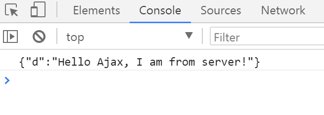
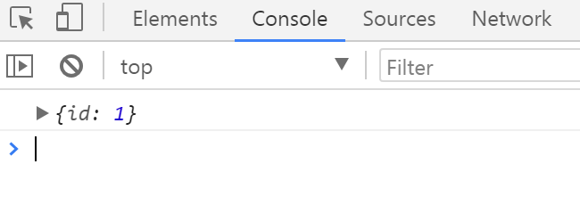

这学期首次接触 .NET 开发，个中遇到了许多的问题。其中，以原生 AJAX 异步请求数据的相关问题最是让我困扰。所以，利用空闲时间好好研究了一下。

## AJAX 的封装

首先，我简单地将 AJAX 封装了一下（使用 ES6 标准）。

<!-- more -->

``` js
/**
 * @desc AJAX 的简单封装
 * @param {String} url 请求路径
 * @param {Object} settings 参数配置
 * @returns {Promise} 包含数据的 Promise 对象
 */
const ajax = function (url, settings = {}) => {
  // set default values
  const {
    method = 'GET',
    responseType = '',
    header = {},
    timeout = 0,
    isAsync = true
    data = null,
  } = settings;

  // get XMLHttpRequest object
  let getXhr = () =>
    new XMLHttpRequest() || new ActiveXObject("Microsoft.XMLHTTP");

  // use to format response data
  class DataFormator {
    constructor(data) {
      this._data = data;
    }

    getJson () {
      let __data = typeof this._data === 'object'
        ? this._data
        : JSON.parse(this._data);

      return __data === null
        ? __data
        : (__data.d && __data.d !== '' ? JSON.parse(__data.d) : __data);
    }

    getText () {
      return this._data;
    }

    // add other format function here
  }

  return new Promise((resolve, reject) => {
    const xhr = getXhr();

    xhr.open(method, url, isAsync);

    xhr.onreadystatechange = function () {
      if (this.readyState !== 4) return;

      this.status === 200
        ? resolve(new DataFormator(this.response))
        : reject(new Error(this.statusText))
    };

    xhr.responseType = responseType;
    xhr.timeout = timeout;

    // set request header
    for (let item in header) {
      xhr.setRequestHeader(item, header[item]);
    }

    xhr.send(data);
  });
}
```

这里主要应用了 Promise 对象对 AJAX 进行封装，使用起来较为简单：

``` js
// 方式一
// 默认使用 GET 请求
ajax(url)
  .then(res => res.getJson()) // or getText
  .then(data => { /* code here ... */ })
  .catch(error => { /* code here ... */ });

// 方式二
ajax(url, settings)
  .then(res => res.getJson()) // or getText
  .then(data => { /* code here ... */ })
  .catch(error => { /* code here ... */ });
```

## 在 WEB FORMS 中

在 ASP.NET Web Forms 中，虽然微软已经封装了一些 AJAX 控件（比如：UpdatePanel），并且在处理一些简单的业务时，已经可以满足要求，然而在处理复杂的业务时，这些控件就不显得那么便捷了，甚至可能出现一些问题。这个时候我们迫切需要一种方法：让我们在前台的 js 代码中使用 AJAX 方法向服务器来发送异步请求，然后服务器响应请求、发送数据，接着在客服端接收数剧并对其处理。那么如何实现呢？

### 方式一

新建一个 ASP.NET Web Forms 空网站，添加 2 个 Web 窗体页面（如：Client.aspx、Server.aspx）。

Client.aspx
``` aspnet
<form id="form1" runat="server">
  <div>
    <a id="btn">test btn</a>
  </div>
  <script src="js/ajax.js"></script>
  <script>
    document.querySelector('#btn').addEventListener('click', () => {
      ajax('Server.aspx')
        .then(res => res.getText())
        .then(data => console.log(data))
        .catch(err => console.log(err));
    });
  </script>
</form>
```

Server.aspx.cs
``` csharp
protected void Page_Load(object sender, EventArgs e)
{
  GetData();
}

protected void GetData()
{
  Response.Write("Hello World");
  Response.End();
}
```

在 Chrome 浏览器运行结果：


当然，我们也可以传递传参：

Client.aspx
``` js
...
ajax('Server.aspx?id=1')
...
```

Server.aspx.cs
``` csharp
protected void Page_Load(object sender, EventArgs e)
{
  GetDataById();
}

protected void GetDataById()
{
  string id = Request["id"];
  Response.Write("ID" + id);
  Response.End();
}
```

在 Chrome 浏览器运行结果：


### 方式二

使用 `Web Service` 属性来编写服务端代码。新建一个 ASP.NET Web Forms 空网站，添加 1 个 Web 窗体页面（如：Index.aspx）。

Index.aspx
``` aspnet
...
<script>
  document.querySelector('#btn').addEventListener('click', () => {
    ajax('Index.aspx/GetData', {
      method: 'POST',
      header: {
        'Content-Type': 'application/json'
      }
    })
      .then(res => res.getText())
      .then(data => console.log(data))
      .catch(err => console.log(err));
  });
</script>
...
```

Index.aspx.cs
``` csharp
[System.Web.Services.WebMethod]
public static String GetData() {
  return "Hello Ajax, I am from server!";
}
```

在 Chrome 浏览器运行结果：



当然，也可以传参：

Index.aspx
``` js
...
ajax('Index.apsx/GetDataById', {
  method: 'POST',
  header: {
    'Content-Type': 'application/json'
  },
  data: JSON.stringify({
    id: 1
  })
})
  .then(res => res.getJson())
...
```

Index.aspx.cs
``` csharp
[System.Web.Services.WebMethod]
public static String GetDataById(int id) {
  return "{\"id\": \"" + id +"\"}";
}
```

在 Chrome 浏览器运行结果：



在实际开发中，服务器端要对数据进行序列化（比如 JSON 序列化），这样才能使前端开发变得更便捷。
