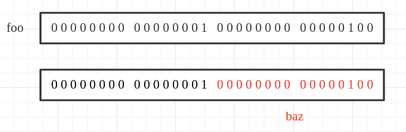
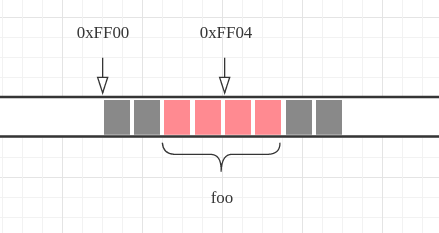
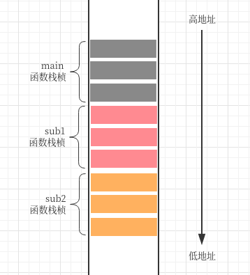
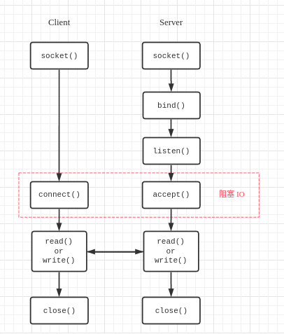

C 是我学的第一门程序语言，也是让我认识和接触计算机、软件开发的开始。至今想来，我的思维有时侯其实存在的最多的还是面向过程的。

常见的 C 的标准：C89，C90，C99，C11。其中，C89、C90 标准相同，又称 ASCI C；C99 应用最广,我当时学的就是这个标准。

在这里，我想将后来学习的 C++、C#、Java、JavaScript 统称为“C 系语言”。虽然它们与 C 是如此的不同。

## 空指针和函数指针

空指针 `void *` 和函数指针的存在是我以前常常忽视的两种特殊的指针。实际上，它们在 C 语言的开发中扮演着极为重要的角色，也与上述提及那些语言存在着极为密切的关系。

### 1、空指针

空指针不代表任何类型，却可以成为任何类型。对它的赋值和转化必须按照相同的类型进行，以保证数据前后的一致性。

```c
int foo = 1;
void *bar = foo;
int baz = (int)bar; /* 1 */
```
也就是说，不一致的转换将在大多数情况下照成数据的缺失。

```c
int foo = 65540;
void *bar = foo;
short baz = (short)bar; /* 4 */
```
这是因为在 C 语言中，类型转换是根据类型的大小重新对内存进行规划的（如图 1）。毫无疑问，在其它的语言当中亦是如此（基本值类型）。空指针的大小根据操作系统的位数来决定（包括其它类型的指针），一般是 32 位系统是 4 字节，64 位系统是 8 字节。

^^^

^^^ 图 1

空指针必须进行类型转换后才能访问。这有点像面向对象语言中的 `Object` 类型的实例，只有在经过类型转换（如拆箱）后它才会有实际意义。

另一方面，空指针的存在也让 C 具有了一定的**泛型**或**模板化**编程的可能性。比如，可以利用它写出一个能交换两个任意类型变量值的程序出来。

```c
#include <string.h> /* memcpy */

/* size 是对应指针类型的大小(单位: Byte) */
void swap(void *ap, void *bp, int size)
{
    char buffer[size];
    memcpy(buffer, ap, size);
    memcpy(ap, bp, size);
    memcpy(bp, buffer, size);
}
```

这个 `swap` 将可以进行不同类型的变量交换，如：

```c
int a = 1, b = 2;
swap(&a, &b, sizeof(int));

char *a = "foo", *b = "bar";
swap(&a, &b, sizeof(char *));
```

也即是说，利用空指针可以写出适应不同类型的通用模型或数据结构出来。

### 2、函数指针

函数指针可以将某个程序的操作延迟到调用，让程序适应不同的调用场景。这与面向对象语言的**多态**特点类似。

函数指针扮演的实际上是回调函数的角色。JavaScript 充分发挥了这一特性。

``` c
/* 使用 cmp 控制升序、降序 */
void sort(int arr[], int len, int (*cmp)(int, int))
{
    int i, j;
    int cur;
    for (i = 1; i < len; i++) {
        cur = arr[i];
        for (j = i - 1; j >= 0 && cmp(arr[j], cur); j--)
            arr[j + 1] = arr[j];
        arr[j + 1] = cur;
    }
}
```

上述程序中，可以在调用该排序函数时，进行具体的 `cmp` 绑定，从而让该排序函数具有升序和降序的可能性。

倘若在一个结构体中定义一些系列的通用函数指针，对于不同的使用对象分别给出各自不同的实现，这样就可以实现面向接口化的编程，而这里的结构体又可以类比成一个**接口**。在 UNIX 操作系统中，`FILE` 这一结构就是这样设计的。

## 内存对齐

> 作者的机器是 64 位 Linux 系统，Intel x86 架构处理器

内存[对齐](https://en.wikipedia.org/wiki/Data_structure_alignment)实际是因为 CPU 的寻址方式所造成的一种对内存分配的优化手段。例如，有些 CPU 每次只能对 4 的倍数的地址进行读取，即每次只能读取 4 字节大小的数据，倘若有数据分布于两段地址区间内，那么 CPU 对该数据的读取将花费 2 次进行（如图 2）。一般而言，经过对齐之后的程序的运行效率高于未作处理的程序。

^^^

^^^ 图 2

在 C 语言中可以对内存对齐进行控制，特别是在结构体 `struct` 中进行这种处理是十分常见的。结构体实际上是一些数据的容器。当对结构体进行地址空间的分配时，实际将根据成员变量的类型及定义顺序进行，并按照默认的对齐方式对内存进行大小分配；成员变量定义的顺序不同，分配的大小可能不同。

一个空的结构体 `sizeof` 得到的是 `0`（单位字节，下同）。

```c
struct person_t {
    int id; /* 4 */
    short age; /* 2 */
    char *name; /* 8 */
    char gender; /* 1 */
};
```

理论上结构体 `struct person_t` 的内存分配的大小为 `4 + 2 + 8 + 1 = 15`，实际为 `24`。这是因为实际分配内存时，在 `age` 和 `name` 之间填充（Padding）了 2 字节大小的空间，在 `gender` 后填充了 7 字节大小的空间。

既然如此，实际当中我们是可以利用这一特性对程序进行内存级别的优化，以减小对内存的占用。例如，针对上面的结构体，可以通过调整结构体中的成员变量的顺序以达到减小内存的目的。

```c
struct person_t {
    int id; /* 4 */
    short age; /* 2 */
    char gender; /* 1 */
    char *name; /* 8 */
};
```

这样，将只在 `gender` 和 `name` 之间填充 1 字节的空间，从而使整个结构体占用的内存空间减小到 16 字节。这在实际应用当中是极为可观的。

因此，对结构体成员变量的定义顺序，一般都遵循着按[对齐长度](https://en.wikipedia.org/wiki/Data_structure_alignment#Typical_alignment_of_C_structs_on_x86)从小到大或从大到小的规则排列。

那么，在其他的面向对象的语言里是否也会发生内存对齐？

以 C# 为例，我分别对值类型（存栈上）的 `struct` 实例和引用类型（引用存栈上，数据存堆上）的 `class` 实例进行内存大小检测。

```csharp
using System;
using System.Runtime.InteropServices;

struct Foo
{
    public int ID { set; get; }
    public short Age { set; get; }
    public char Gender { set; get; }
    public string Name { set; get; }
}

// 使布局连续以支持 Marshal.SizeOf 调用
[StructLayout(LayoutKind.Sequential)]
class Bar
{
    public int ID { set; get; }
    public short Age { set; get; }
    public string Name { set; get; }
    public char Gender { set; get; }
}

class Program
{
    static void Main(string[] args)
    {
        Console.WriteLine(Marshal.SizeOf(new Foo())); // 16
        Console.WriteLine(Marshal.SizeOf(new Bar())); // 24
    }
}
```

结果显示，未作优化 `Bar` 类实例的内存占用高于 `Foo` 结构体实例。但需要注意的是，实际开发中，对类实例的内存对齐优化将交由 .NET 平台来完成。同理，在 JVM 中也是如此。

## 栈和堆

这里讲的栈和堆指的是内存模型，而不是数据结构，虽然它们彼此具有相似的特性。在 C 中，存储区主要分为栈区、堆区、数据区和代码区。

在内存中，堆区位于内存的底部（低地址区），而栈区位于内存的顶部（高地址区）。

对一个程序来说，每个子程序（即函数）根据都会在内存中分配一个栈桢（Stack Frame），这些栈桢将会组成一个[调用栈](https://en.wikipedia.org/wiki/Call_stack)（Call Stack）。栈桢的内存分配是根据彼此之间的调用关系，从栈区的顶部向低地址区进行分配的。栈桢的内存在到它调用完成后就被释放回收。

```c
void sub2()
{
    int baz = 3;
}

void sub1()
{
    int bar = 2;
    sub2();
}

int main(void)
{
    int foo = 1;
    sub1();
    return 0;
}
```

对于上述程序，将在内存中形成如下图所示的栈桢。`main` 函数将首先分配栈桢，之后依次是 `sub1`、`sub2`；然后当 `sub2` 调用结束后，其内存将会被立刻回收，之后回到 `sub1` 中继续执行，并最终回到 `main` 函数中，直到结束整个调用。这其实可以说是对栈的特性 LIFO（后进先出） 的一种应用。

^^^

^^^ 图 3

当然，对于每个栈桢内部而言，将对函数的参数列表、返回地址、局部变量等，按内存地址由低向高的顺序进行分配。这与堆区的内存分配是相同的。

堆的生存期是跟随整个程序进程的，而栈是函数运行时（Runtime）的。

## 进程和线程

进程（Process）是操作系统的基本组成部分，是系统资源分配的基本单位——但在现在的多数面向线程（Thread）设计的操作系统（如 Linux 2.4 及更新版本）中，进程只不过是真正执行实体——线程——的容器，其本身只包含指令、数据及其组织形式的描述。即使说，进程实际上就是个[文件描述者](https://en.wikipedia.org/wiki/File_descriptor)（File Descriptor）或文件句柄（File Handle），它的值是一个无符号的长整型数字，它最终将索引到一个具体的文件上去（如图 4）。

^^^

^^^ 图 4

对于一个 CPU 而言，进程的处理是每个时刻只能处理一个进程的任务，但进程却是可以同时存在的。CPU 通过进行进程上下文的快速切换（时间极快）来实现同时执行的效果。线程的并行执行实际也是依赖于 CPU 对线程上下文的快速切换，当然对于多核 CPU 而言，可以将其分配到不同的内核进行处理。

<!--  -->
^^^

^^^ 图 5 多线程进程

每一个进程的资源是独立分配的，它们相互之间是无法直接访问的。同一进程内的线程共享进程的资源。

在 Linux 系统中，对进程的管理有两个特殊的函数： `fork()` 和 `vfork()`。前者创建一个子进程，后者创建一个阻塞（Block）父进程的子进程。这两个函数会造成进程发生像细胞一样的分裂，且每次子进程都会继承父进程的资源，并自分裂处继续执行。

```c
#include <stdio.h>
#include <unistd.h>

int main(void)
{
    pid_t pid = fork();
    printf("Hello, my pid is %d.\n", pid);
    return 0;
}
```

上述的代码可能的输出：

```bash
Hello, my pid is 22715.
Hello, my pid is 0.
```

在 C 中进行线程编程使用的接口是 POSIX 或 Pthreads，这是由 [IEEE POSIX 1003.1c](http://www.unix.org/version3/ieee_std.html) 标准进行规定的。利用 `pthread.h` 头文件可以实现对线程的基本管理。

```c
#include <stdio.h>
#include <pthread.h>

void *print_hello(void *arg)
{
    long tid;
    tid = (long)arg; /* 获取线程 ID */
    printf("Thread #%ld: Hello World!\n", tid);
    pthread_exit(NULL);
}

int main(void)
{
    pthread_t thread;
    int result;
    long tid;

    tid = 1; /* 指定一个线程 ID */
    printf("In main: creating a thread %ld\n", tid);
    result = pthread_create(&thread, NULL, print_hello, (void *)tid);
    if (result) {
        printf("ERROR: code from pthread_create() is %d\n", result);
        return -1;
    }

    /* Last thing that main() should do */
    pthread_exit(NULL);
}
```

编译时，需要使用 `-lpthread` 进行链接。

一个线程的典型生命周期（lifecycle）：

```txt
          NEW
           |
           V
   +---> READY ---+
   |       ^      |
   |       |      V
WAITING <--+-- RUNNING
                  |
   :              V
SUSPENDED       DEAD
```

## 协程

协程是协作式多任务的，而线程典型是抢占式多任务的。这意味着协程提供并发性而非并行性。在协程之间的切换不需要涉及任何系统调用或任何阻塞调用。


## 套接字

> A socket forms one end of a connection, and a connection is fully specified by a pair of sockets. -- [RFC33, p.6](https://www.rfc-editor.org/rfc/rfc33.html#page-6)

套接字（Socket）是一种特殊的文件。为解决进程间的通讯而生。在 RFC33 中，套接字被定义由 3 部分组成：

<!-- - a user number (24 bits)
- a HOST number (8 bits)
- AEN (8 bits) -->

```txt
       24                    8          8
+----------------------+-----------+----------+
|  User Number         |           |          |
+----------------------+-----------+----------+
                             |          |___AEN (another eight-bit number)
                             |
                             |___HOST number
```

一个套接字构成一个连接的一端，利用这三者的组合就能在网络中定位到对应设备上的进程，从而进行通讯。需要注意的是，这一组成定义是专门针对 [ARPA 网络](https://www.wanweibaike.com/wiki-ARPANET)而设计的。

现代常见的套接字接口大多源自 [Berkeley 套接字](https://www.wanweibaike.com/wiki-Berkeley套接字)（Berkeley sockets）标准。它定义了一系列的[套接字 API 函数](https://www.wanweibaike.com/wiki-Berkeley套接字#套接字API函数)，利用这些函数，按照一定调用流程（如下图）即可实现进程间的简单通信。

^^^

^^^ 图 6

调用 `scoket()` 函数返回的是一个套接字文件描述符。需要使用 `bind()` 给它关联一个套接字地址（socket address）才能实现一个合法而可用的套接字，也即一个套接字将由以下 3 个部分组成：

- IP 地址
- 端口
- 协议

这三者的组合在一台主机上是唯一的。

## 参考资料

1. [POSIX Threads Programming](https://computing.llnl.gov/tutorials/pthreads/)
2. [RFC33: New HOST-HOST Protocol](https://www.rfc-editor.org/rfc/rfc33.html)
3. [4.2BSD Networking Implementation Notes](https://digitalassets.lib.berkeley.edu/techreports/ucb/text/CSD-83-146.pdf)
