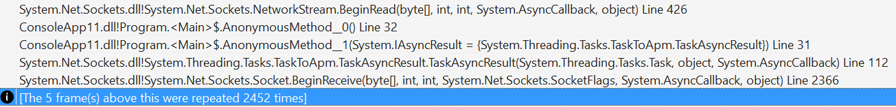
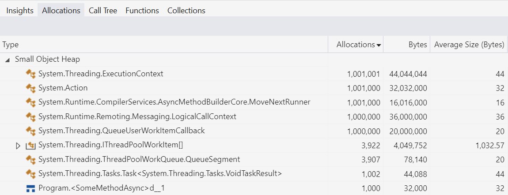
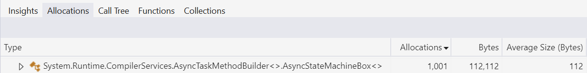

> 原文：[Stephen Toub, How Async/Await Really Works in C#](https://devblogs.microsoft.com/dotnet/how-async-await-really-works/)

Several weeks ago, the [.NET Blog](https://devblogs.microsoft.com/dotnet/) featured a post [What is .NET, and why should you choose it?](https://devblogs.microsoft.com/dotnet/why-dotnet/). It provided a high-level overview of the platform, summarizing various components and design decisions, and promising more in-depth posts on the covered areas. This post is the first such follow-up, deep-diving into the history leading to, the design decisions behind, and implementation details of async/await in C# and .NET.

The support for `async`/`await` has been around now for over a decade. In that time, it’s transformed how scalable code is written for .NET, and it’s both viable and extremely common to utilize the functionality without understanding exactly what’s going on under the covers. You start with a synchronous method like the following (this method is “synchronous” because a caller will not be able to do anything else until this whole operation completes and control is returned back to the caller):

```csharp
// Synchronously copy all data from source to destination.
public void CopyStreamToStream(Stream source, Stream destination)
{
    var buffer = new byte[0x1000];
    int numRead;
    while ((numRead = source.Read(buffer, 0, buffer.Length)) != 0)
    {
        destination.Write(buffer, 0, numRead);
    }
}
```

Then you sprinkle a few keywords, change a few method names, and you end up with the following asynchronous method instead (this method is “asynchronous” because control is expected to be returned back to its caller very quickly and possibly before the work associated with the whole operation has completed):

```csharp
// Asynchronously copy all data from source to destination.
public async Task CopyStreamToStreamAsync(Stream source, Stream destination)
{
    var buffer = new byte[0x1000];
    int numRead;
    while ((numRead = await source.ReadAsync(buffer, 0, buffer.Length)) != 0)
    {
        await destination.WriteAsync(buffer, 0, numRead);
    }
}
```
Almost identical in syntax, still able to utilize all of the same control flow constructs, but now non-blocking in nature, with a significantly different underlying execution model, and with all the heavy lifting done for you under the covers by the C# compiler and core libraries.

While it’s common to use this support without knowing exactly what’s happening under the hood, I’m a firm believer that understanding how something actually works helps you to make even better use of it. For async/await in particular, understanding the mechanisms involved is especially helpful when you want to look below the surface, such as when you’re trying to debug things gone wrong or improve the performance of things otherwise gone right. In this post, then, we’ll deep-dive into exactly how await works at the language, compiler, and library level, so that you can make the most of these valuable features.

To do that well, though, we need to go way back to before async/await to understand what state-of-the-art asynchronous code looked like in its absence. Fair warning, it wasn’t pretty.

## 最初..

早在 .NET Framework 1.0 中就已经存在着一个异步编程模型，即众所周知的 APM 模式、 Begin/End 模式、`IAsyncResult` 模式。这个模式让异步操作在高层次的使用中变得简单。例如，对于一个异步操作 `DoStuff`：  <!--All the way back in .NET Framework 1.0, there was the Asynchronous Programming Model pattern, otherwise known as the APM pattern, otherwise known as the Begin/End pattern, otherwise known as the IAsyncResult pattern. At a high-level, the pattern is simple. For a synchronous operation `DoStuff`: -->

```csharp
class Handler
{
    public int DoStuff(string arg);
}
```
那么它将有两个相应的方法来组成这个模式：`BeginDoStuff` 方法和 `EndDoStuff` 方法。
<!-- there would be two corresponding methods as part of the pattern: a `BeginDoStuff` method and an `EndDoStuff` method: -->

```csharp
class Handler
{
    public int DoStuff(string arg);

    public IAsyncResult BeginDoStuff(string arg, AsyncCallback? callback, object? state);
    public int EndDoStuff(IAsyncResult asyncResult);
}
```
`BeginDoStuff` would accept all of the same parameters as does `DoStuff`, but in addition it would also accept an [`AsyncCallback`](https://github.com/dotnet/runtime/blob/967a59712996c2cdb8ce2f65fb3167afbd8b01f3/src/libraries/System.Private.CoreLib/src/System/AsyncCallback.cs#L14) delegate and an opaque state `object`, one or both of which could be `null`. The Begin method was responsible for initiating the asynchronous operation, and if provided with a callback (often referred to as the “continuation” for the initial operation), it was also responsible for ensuring the callback was invoked when the asynchronous operation completed. The Begin method would also construct an instance of a type that implemented [`IAsyncResult`](https://github.com/dotnet/runtime/blob/967a59712996c2cdb8ce2f65fb3167afbd8b01f3/src/libraries/System.Private.CoreLib/src/System/IAsyncResult.cs#L17-L27), using the optional `state` to populate that `IAsyncResult`‘s `AsyncState` property:

```csharp
namespace System
{
    public interface IAsyncResult
    {
        object? AsyncState { get; }
        WaitHandle AsyncWaitHandle { get; }
        bool IsCompleted { get; }
        bool CompletedSynchronously { get; }
    }

    public delegate void AsyncCallback(IAsyncResult ar);
}
```
This IAsyncResult instance would then both be returned from the Begin method as well as passed to the AsyncCallback when it was eventually invoked. When ready to consume the results of the operation, a caller would then pass that IAsyncResult instance to the End method, which was responsible for ensuring the operation was completed (synchronously waiting for it to complete by blocking if it wasn’t) and then returning any result of the operation, including propagating any errors/exceptions that may have occurred. Thus, instead of writing code like the following to perform the operation synchronously:

```csharp
try
{
    int i = handler.DoStuff(arg);
    Use(i);
}
catch (Exception e)
{
    ... // handle exceptions from DoStuff and Use
}
```
the Begin/End methods could be used in the following manner to perform the same operation asynchronously:

```csharp
try
{
    handler.BeginDoStuff(arg, iar =>
    {
        try
        {
            Handler handler = (Handler)iar.AsyncState!;
            int i = handler.EndDoStuff(iar);
            Use(i);
        }
        catch (Exception e2)
        {
            ... // handle exceptions from EndDoStuff and Use
        }
    }, handler);
}
catch (Exception e)
{
    ... // handle exceptions thrown from the synchronous call to BeginDoStuff
}
```
For anyone who’s dealt with callback-based APIs in any language, this should feel familiar.

Things only got more complicated from there, however. For instance, there’s the issue of “stack dives.” A stack dive is when code repeatedly makes calls that go deeper and deeper on the stack, to the point where it could potentially stack overflow. The Begin method is allowed to invoke the callback synchronously if the operation completes synchronously, meaning the call to Begin might itself directly invoke the callback. And “asynchronous” operations that complete synchronously are actually very common; they’re not “asynchronous” because they’re guaranteed to complete asynchronously but rather are just permitted to. For example, consider an asynchronous read from some networked operation, like receiving from a socket. If you need only a small amount of data for each individual operation, such as reading some header data from a response, you might put a buffer in place in order to avoid the overhead of lots of system calls. Instead of doing a small read for just the amount of data you need immediately, you perform a larger read into the buffer and then consume data from that buffer until its exhausted; that lets you reduce the number of expensive system calls required to actually interact with the socket. Such a buffer might exist behind whatever asynchronous abstraction you’re using, such that the first “asynchronous” operation you perform (filling the buffer) completes asynchronously, but then all subsequent operations until that underlying buffer is exhausted don’t actually need to do any I/O, instead just pulling from the buffer, and can thus all complete synchronously. When the Begin method performs one of these operations, and finds it completes synchronously, it can then invoke the callback synchronously. That means you have one stack frame that called the Begin method, another stack frame for the Begin method itself, and now another stack frame for the callback. Now what happens if that callback turns around and calls Begin again? If that operation completes synchronously and its callback is invoked synchronously, you’re now again several more frames deep on the stack. And so on, and so on, until eventually you run out of stack.

This is a real possibility that’s easy to repro. Try this program on .NET Core:

```csharp
using System.Net;
using System.Net.Sockets;

using Socket listener = new Socket(AddressFamily.InterNetwork, SocketType.Stream, ProtocolType.Tcp);
listener.Bind(new IPEndPoint(IPAddress.Loopback, 0));
listener.Listen();

using Socket client = new Socket(AddressFamily.InterNetwork, SocketType.Stream, ProtocolType.Tcp);
client.Connect(listener.LocalEndPoint!);

using Socket server = listener.Accept();
_ = server.SendAsync(new byte[100_000]);

var mres = new ManualResetEventSlim();
byte[] buffer = new byte[1];

var stream = new NetworkStream(client);

void ReadAgain()
{
    stream.BeginRead(buffer, 0, 1, iar =>
    {
        if (stream.EndRead(iar) != 0)
        {
            ReadAgain(); // uh oh!
        }
        else
        {
            mres.Set();
        }
    }, null);
};
ReadAgain();

mres.Wait();
```
Here I’ve set up a simple client socket and server socket connected to each other. The server sends 100,000 bytes to the client, which then proceeds to use BeginRead/EndRead to consume them “asynchronously” one at a time (this is terribly inefficient and is only being done in the name of pedagogy). The callback passed to BeginRead finishes the read by calling EndRead, and then if it successfully read the desired byte (in which case it wasn’t yet at end-of-stream), it issues another BeginRead via a recursive call to the ReadAgain local function. However, in .NET Core, socket operations are much faster than they were on .NET Framework, and will complete synchronously if the OS is able to satisfy the operation synchronously (noting the kernel itself has a buffer used to satisfy socket receive operations). Thus, this stack overflows:



So, compensation for this was built into the APM model. There are two possible ways to compensate for this:

1. Don’t allow the AsyncCallback to be invoked synchronously. If it’s always invoked asynchronously, even if the operation completes synchronously, then the risk of stack dives goes away. But so too does performance, because operations that complete synchronously (or so quickly that they’re observably indistinguishable) are very common, and forcing each of those to queue its callback adds measurable overhead.
2. Employ a mechanism that allows the caller rather than the callback to do the continuation work if the operation completes synchronously. That way, you escape the extra method frame and continue doing the follow-on work no deeper on the stack.

The APM pattern goes with option (2). For that, the IAsyncResult interface exposes two related but distinct members: IsCompleted and CompletedSynchronously. IsCompleted tells you whether the operation has completed: you can check it multiple times, and eventually it’ll transition from false to true and then stay there. In contrast, CompletedSynchronously never changes (or if it does, it’s a nasty bug waiting to happen); it’s used to communicate between the caller of the Begin method and the AsyncCallback which of them is responsible for performing any continuation work. If CompletedSynchronously is false, then the operation is completing asynchronously and any continuation work in response to the operation completing should be left up to the callback; after all, if the work didn’t complete synchronously, the caller of Begin can’t really handle it because the operation isn’t known to be done yet (and if the caller were to just call End, it would block until the operation completed). If, however, CompletedSynchronously is true, if the callback were to handle the continuation work, then it risks a stack dive, as it’ll be performing that continuation work deeper on the stack than where it started. Thus, any implementations at all concerned about such stack dives need to examine CompletedSynchronously and have the caller of the Begin method do the continuation work if it’s true, which means the callback then needs to not do the continuation work. This is also why CompletedSynchronously must never change: the caller and the callback need to see the same value to ensure that the continuation work is performed once and only once, regardless of race conditions.

In our previous DoStuff example, that then leads to code like this:

```csharp
try
{
    IAsyncResult ar = handler.BeginDoStuff(arg, iar =>
    {
        if (!iar.CompletedSynchronously)
        {
            try
            {
                Handler handler = (Handler)iar.AsyncState!;
                int i = handler.EndDoStuff(iar);
                Use(i);
            }
            catch (Exception e2)
            {
                ... // handle exceptions from EndDoStuff and Use
            }
        }
    }, handler);
    if (ar.CompletedSynchronously)
    {
        int i = handler.EndDoStuff(ar);
        Use(i);
    }
}
catch (Exception e)
{
    ... // handle exceptions that emerge synchronously from BeginDoStuff and possibly EndDoStuff/Use
}
```
That’s a mouthful. And so far we’ve only looked at consuming the pattern… we haven’t looked at implementing the pattern. While most developers wouldn’t need to be concerned about leaf operations (e.g. implementing the actual Socket.BeginReceive/EndReceive methods that interact with the operating system), many, many developers would need to be concerned with composing these operations (performing multiple asynchronous operations that together form a larger one), which means not only consuming other Begin/End methods but also implementing them yourself so that your composition itself can be consumed elsewhere. And, you’ll notice there was no control flow in my previous DoStuff example. Introduce multiple operations into this, especially with even simple control flow like a loop, and all of a sudden this becomes the domain of experts that enjoy pain, or blog post authors trying to make a point.

So just to drive that point home, let’s implement a complete example. At the beginning of this post, I showed a CopyStreamToStream method that copies all of the data from one stream to another (à la Stream.CopyTo, but, for the sake of explanation, assuming that doesn’t exist):

```csharp
public void CopyStreamToStream(Stream source, Stream destination)
{
    var buffer = new byte[0x1000];
    int numRead;
    while ((numRead = source.Read(buffer, 0, buffer.Length)) != 0)
    {
        destination.Write(buffer, 0, numRead);
    }
}
```
Straightforward: we repeatedly read from one stream and then write the resulting data to the other, read from one stream and write to the other, and so on, until we have no more data to read. Now, how would we implement this asynchronously using the APM pattern? Something like this:

```csharp
public IAsyncResult BeginCopyStreamToStream(
    Stream source, Stream destination,
    AsyncCallback callback, object state)
{
    var ar = new MyAsyncResult(state);
    var buffer = new byte[0x1000];

    Action<IAsyncResult?> readWriteLoop = null!;
    readWriteLoop = iar =>
    {
        try
        {
            for (bool isRead = iar == null; ; isRead = !isRead)
            {
                if (isRead)
                {
                    iar = source.BeginRead(buffer, 0, buffer.Length, static readResult =>
                    {
                        if (!readResult.CompletedSynchronously)
                        {
                            ((Action<IAsyncResult?>)readResult.AsyncState!)(readResult);
                        }
                    }, readWriteLoop);

                    if (!iar.CompletedSynchronously)
                    {
                        return;
                    }
                }
                else
                {
                    int numRead = source.EndRead(iar!);
                    if (numRead == 0)
                    {
                        ar.Complete(null);
                        callback?.Invoke(ar);
                        return;
                    }

                    iar = destination.BeginWrite(buffer, 0, numRead, writeResult =>
                    {
                        if (!writeResult.CompletedSynchronously)
                        {
                            try
                            {
                                destination.EndWrite(writeResult);
                                readWriteLoop(null);
                            }
                            catch (Exception e2)
                            {
                                ar.Complete(e);
                                callback?.Invoke(ar);
                            }
                        }
                    }, null);

                    if (!iar.CompletedSynchronously)
                    {
                        return;
                    }

                    destination.EndWrite(iar);
                }
            }
        }
        catch (Exception e)
        {
            ar.Complete(e);
            callback?.Invoke(ar);
        }
    };

    readWriteLoop(null);

    return ar;
}

public void EndCopyStreamToStream(IAsyncResult asyncResult)
{
    if (asyncResult is not MyAsyncResult ar)
    {
        throw new ArgumentException(null, nameof(asyncResult));
    }

    ar.Wait();
}

private sealed class MyAsyncResult : IAsyncResult
{
    private bool _completed;
    private int _completedSynchronously;
    private ManualResetEvent? _event;
    private Exception? _error;

    public MyAsyncResult(object? state) => AsyncState = state;

    public object? AsyncState { get; }

    public void Complete(Exception? error)
    {
        lock (this)
        {
            _completed = true;
            _error = error;
            _event?.Set();
        }
    }

    public void Wait()
    {
        WaitHandle? h = null;
        lock (this)
        {
            if (_completed)
            {
                if (_error is not null)
                {
                    throw _error;
                }
                return;
            }

            h = _event ??= new ManualResetEvent(false);
        }

        h.WaitOne();
        if (_error is not null)
        {
            throw _error;
        }
    }

    public WaitHandle AsyncWaitHandle
    {
        get
        {
            lock (this)
            {
                return _event ??= new ManualResetEvent(_completed);
            }
        }
    }

    public bool CompletedSynchronously
    {
        get
        {
            lock (this)
            {
                if (_completedSynchronously == 0)
                {
                    _completedSynchronously = _completed ? 1 : -1;
                }

                return _completedSynchronously == 1;
            }
        }
    }

    public bool IsCompleted
    {
        get
        {
            lock (this)
            {
                return _completed;
            }
        }
    }
}
```
Yowsers. And, even with all of that gobbledygook, it’s still not a great implementation. For example, the IAsyncResult implementation is locking on every operation rather than doing things in a more lock-free manner where possible, the Exception is being stored raw rather than as an ExceptionDispatchInfo that would enable augmenting its call stack when propagated, there’s a lot of allocation involved in each individual operation (e.g. a delegate being allocated for each BeginWrite call), and so on. Now, imagine having to do all of this for each method you wanted to write. Every time you wanted to write a reusable method that would consume another asynchronous operation, you’d need to do all of this work. And if you wanted to write reusable combinators that could operate over multiple discrete IAsyncResults efficiently (think Task.WhenAll), that’s another level of difficulty; every operation implementing and exposing its own APIs specific to that operation meant there was no lingua franca for talking about them all similarly (though some developers wrote libraries that tried to ease the burden a bit, typically via another layer of callbacks that enabled the API to supply an appropriate AsyncCallback to a Begin method).

And all of that complication meant that very few folks even attempted this, and for those who did, well, bugs were rampant. To be fair, this isn’t really a criticism of the APM pattern. Rather, it’s a critique of callback-based asynchrony in general. We’re all so used to the power and simplicity that control flow constructs in modern languages provide us with, and callback-based approaches typically run afoul of such constructs once any reasonable amount of complexity is introduced. No other mainstream language had a better alternative available, either.

We needed a better way, one in which we learned from the APM pattern, incorporating the things it got right while avoiding its pitfalls. An interesting thing to note is that the APM pattern is just that, a pattern; the runtime, core libraries, and compiler didn’t provide any assistance in consuming or implementing the pattern.

## Event-Based Asynchronous Pattern

.NET Framework 2.0 saw a few APIs introduced that implemented a different pattern for handling asynchronous operations, one primarily intended for doing so in the context of client applications. This Event-based Asynchronous Pattern, or EAP, also came as a pair of members (at least, possibly more), this time a method to initiate the asynchronous operation and an event to listen for its completion. Thus, our earlier DoStuff example might have been exposed as a set of members like this:

```csharp
class Handler
{
    public int DoStuff(string arg);

    public void DoStuffAsync(string arg, object? userToken);
    public event DoStuffEventHandler? DoStuffCompleted;
}

public delegate void DoStuffEventHandler(object sender, DoStuffEventArgs e);

public class DoStuffEventArgs : AsyncCompletedEventArgs
{
    public DoStuffEventArgs(int result, Exception? error, bool canceled, object? userToken) :
        base(error, canceled, usertoken) => Result = result;

    public int Result { get; }
}
```
You’d register your continuation work with the DoStuffCompleted event and then invoke the DoStuffAsync method; it would initiate the operation, and upon that operation’s completion, the DoStuffCompleted event would be raised asynchronously from the caller. The handler could then run its continuation work, likely validating that the userToken supplied matched the one it was expecting, enabling multiple handlers to be hooked up to the event at the same time.

This pattern made a few use cases a bit easier while making other uses cases significantly harder (and given the previous APM CopyStreamToStream example, that’s saying something). It didn’t get rolled out in a widespread manner, and it came and went effectively in a single release of .NET Framework, albeit leaving behind the APIs added during its tenure, like Ping.SendAsync/Ping.PingCompleted:

```csharp
public class Ping : Component
{
    public void SendAsync(string hostNameOrAddress, object? userToken);
    public event PingCompletedEventHandler? PingCompleted;
    ...
}
```
However, it did add one notable advance that the APM pattern didn’t factor in at all, and that has endured into the models we embrace today: SynchronizationContext.

SynchronizationContext was also introduced in .NET Framework 2.0, as an abstraction for a general scheduler. In particular, SynchronizationContext‘s most used method is Post, which queues a work item to whatever scheduler is represented by that context. The base implementation of SynchronizationContext, for example, just represents the ThreadPool, and so the base implementation of SynchronizationContext.Post simply delegates to ThreadPool.QueueUserWorkItem, which is used to ask the ThreadPool to invoke the supplied callback with the associated state on one the pool’s threads. However, SynchronizationContext‘s bread-and-butter isn’t just about supporting arbitrary schedulers, rather it’s about supporting scheduling in a manner that works according to the needs of various application models.

Consider a UI framework like Windows Forms. As with most UI frameworks on Windows, controls are associated with a particular thread, and that thread runs a message pump which runs work that’s able to interact with those controls: only that thread should try to manipulate those controls, and any other thread that wants to interact with the controls should do so by sending a message to be consumed by the UI thread’s pump. Windows Forms makes this easy with methods like Control.BeginInvoke, which queues the supplied delegate and arguments to be run by whatever thread is associated with that Control. You can thus write code like this:

```csharp
private void button1_Click(object sender, EventArgs e)
{
    ThreadPool.QueueUserWorkItem(_ =>
    {
        string message = ComputeMessage();
        button1.BeginInvoke(() =>
        {
            button1.Text = message;
        });
    });
}
```
That will offload the ComputeMessage() work to be done on a ThreadPool thread (so as to keep the UI responsive while it’s being processed), and then when that work has completed, queue a delegate back to the thread associated with button1 to update button1‘s label. Easy enough. WPF has something similar, just with its Dispatcher type:

```csharp
private void button1_Click(object sender, RoutedEventArgs e)
{
    ThreadPool.QueueUserWorkItem(_ =>
    {
        string message = ComputeMessage();
        button1.Dispatcher.InvokeAsync(() =>
        {
            button1.Content = message;
        });
    });
}
```
And .NET MAUI has something similar. But what if I wanted to put this logic into a helper method? e.g.

```csharp
// Call ComputeMessage and then invoke the update action to update controls.
internal static void ComputeMessageAndInvokeUpdate(Action<string> update) { ... }
I could then use that like this:

private void button1_Click(object sender, EventArgs e)
{
    ComputeMessageAndInvokeUpdate(message => button1.Text = message);
}
but how could ComputeMessageAndInvokeUpdate be implemented in such a way that it could work in any of those applications? Would it need to be hardcoded to know about every possible UI framework? That’s where SynchronizationContext shines. We might implement the method like this:

internal static void ComputeMessageAndInvokeUpdate(Action<string> update)
{
    SynchronizationContext? sc = SynchronizationContext.Current;
    ThreadPool.QueueUserWorkItem(_ =>
    {
        string message = ComputeMessage();
        if (sc is not null)
        {
            sc.Post(_ => update(message), null);
        }
        else
        {
            update(message);
        }
    });
}
```
That uses the SynchronizationContext as an abstraction to target whatever “scheduler” should be used to get back to the necessary environment for interacting with the UI. Each application model then ensures it’s published as SynchronizationContext.Current a SynchronizationContext-derived type that does the “right thing.” For example, Windows Forms has this:

```csharp
public sealed class WindowsFormsSynchronizationContext : SynchronizationContext, IDisposable
{
    public override void Post(SendOrPostCallback d, object? state) =>
        _controlToSendTo?.BeginInvoke(d, new object?[] { state });
    ...
}
```
and WPF has this:

```csharp
public sealed class DispatcherSynchronizationContext : SynchronizationContext
{
    public override void Post(SendOrPostCallback d, Object state) =>
        _dispatcher.BeginInvoke(_priority, d, state);
    ...
}
```
ASP.NET used to have one, which didn’t actually care about what thread work ran on, but rather that work associated with a given request was serialized such that multiple threads wouldn’t concurrently be accessing a given HttpContext:

```csharp
internal sealed class AspNetSynchronizationContext : AspNetSynchronizationContextBase
{
    public override void Post(SendOrPostCallback callback, Object state) =>
        _state.Helper.QueueAsynchronous(() => callback(state));
    ...
}
```
This also isn’t limited to such main application models. For example, xunit is a popular unit testing framework, one that .NET’s core repos use for their unit testing, and it also employs multiple custom SynchronizationContexts. You can, for example, allow tests to run in parallel but limit the number of tests that are allowed to be running concurrently. How is that enabled? Via a SynchronizationContext:

```csharp
public class MaxConcurrencySyncContext : SynchronizationContext, IDisposable
{
    public override void Post(SendOrPostCallback d, object? state)
    {
        var context = ExecutionContext.Capture();
        workQueue.Enqueue((d, state, context));
        workReady.Set();
    }
}
```
MaxConcurrencySyncContext‘s Post method just queues the work to its own internal work queue, which it then processes on its own worker threads, where it controls how many there are based on the max concurrency desired. You get the idea.

How does this tie in with the Event-based Asynchronous Pattern? Both EAP and SynchronizationContext were introduced at the same time, and the EAP dictated that the completion events should be queued to whatever SynchronizationContext was current when the asynchronous operation was initiated. To simplify that ever so slightly (and arguably not enough to warrant the extra complexity), some helper types were also introduced in System.ComponentModel, in particular AsyncOperation and AsyncOperationManager. The former was just a tuple that wrapped the user-supplied state object and the captured SynchronizationContext, and the latter just served as a simple factory to do that capture and create the AsyncOperation instance. Then EAP implementations would use those, e.g. Ping.SendAsync called AsyncOperationManager.CreateOperation to capture the SynchronizationContext, and then when the operation completed, the AsyncOperation‘s PostOperationCompleted method would be invoked to call the stored SynchronizationContext‘s Post method.

SynchronizationContext provides a few more trinkets worthy of mention as they’ll show up again in a bit. In particular, it exposes OperationStarted and OperationCompleted methods. The base implementation of these virtuals are empty, doing nothing, but a derived implementation might override these to know about in-flight operations. That means EAP implementations would also invoke these OperationStarted/OperationCompleted at the beginning and end of each operation, in order to inform any present SynchronizationContext and allow it to track the work. This is particularly relevant to the EAP pattern because the methods that initiate the async operations are void returning: you get nothing back that allows you to track the work individually. We’ll get back to that.

So, we needed something better than the APM pattern, and the EAP that came next introduced some new things but didn’t really address the core problems we faced. We still needed something better.

## Enter Tasks

.NET Framework 4.0 introduced the System.Threading.Tasks.Task type. At its heart, a Task is just a data structure that represents the eventual completion of some asynchronous operation (other frameworks call a similar type a “promise” or a “future”). A Task is created to represent some operation, and then when the operation it logically represents completes, the results are stored into that Task. Simple enough. But the key feature that Task provides that makes it leaps and bounds more useful than IAsyncResult is that it builds into itself the notion of a continuation. That one feature means you can walk up to any Task and ask to be notified asynchronously when it completes, with the task itself handling the synchronization to ensure the continuation is invoked regardless of whether the task has already completed, hasn’t yet completed, or is completing concurrently with the notification request. Why is that so impactful? Well, if you remember back to our discussion of the old APM pattern, there were two primary problems.

You had to implement a custom IAsyncResult implementation for every operation: there was no built-in IAsyncResult implementation anyone could just use for their needs.
You had to know prior to the Begin method being called what you wanted to do when it was complete. This makes it a significant challenge to implement combinators and other generalized routines for consuming and composing arbitrary async implementations.
In contrast, with Task, that shared representation lets you walk up to an async operation after you’ve already initiated the operation and provide a continuation after you’ve already initiated the operation… you don’t need to provide that continuation to the method that initiates the operation. Everyone who has asynchronous operations can produce a Task, and everyone who consumes asynchronous operations can consume a Task, and nothing custom needs to be done to connect the two: Task becomes the lingua franca for enabling producers and consumers of asynchronous operations to talk. And that has changed the face of .NET. More on that in a bit…

For now, let’s better understand what this actually means. Rather than dive into the intricate code for Task, we’ll do the pedagogical thing and just implement a simple version. This isn’t meant to be a great implementation, rather only complete enough functionally to help understand the meat of what is a Task, which, at the end of the day, is really just a data structure that handles coordinating the setting and reception of a completion signal. We’ll start with just a few fields:

```csharp
class MyTask
{
    private bool _completed;
    private Exception? _error;
    private Action<MyTask>? _continuation;
    private ExecutionContext? _ec;
    ...
}
```
We need a field to know whether the task has completed (_completed), and we need a field to store any error that caused the task to fail (_error); if we were also implementing a generic MyTask<TResult>, there’d also be a private TResult _result field for storing the successful result of the operation. Thus far, this looks a lot like our custom IAsyncResult implementation earlier (not a coincidence, of course). But now the pièce de résistance, the _continuation field. In this simple implementation, we’re supporting just a single continuation, but that’s enough for explanatory purposes (the real Task employs an object field that can either be an individual continuation object or a List<> of continuation objects). This is a delegate that will be invoked when the task completes.

Now, a bit of surface area. As noted, one of the fundamental advances in Task over previous models was the ability to supply the continuation work (the callback) after the operation was initiated. We need a method to let us do that, so let’s add ContinueWith:

```csharp
public void ContinueWith(Action<MyTask> action)
{
    lock (this)
    {
        if (_completed)
        {
            ThreadPool.QueueUserWorkItem(_ => action(this));
        }
        else if (_continuation is not null)
        {
            throw new InvalidOperationException("Unlike Task, this implementation only supports a single continuation.");
        }
        else
        {
            _continuation = action;
            _ec = ExecutionContext.Capture();
        }
    }
}
```
If the task has already been marked completed by the time ContinueWith is called, ContinueWith just queues the execution of the delegate. Otherwise, the method stores the delegate, such that the continuation may be queued when the task completes (it also stores something called an ExecutionContext, and then uses that when the delegate is later invoked, but don’t worry about that part for now… we’ll get to it). Simple enough.

Then we need to be able to mark the MyTask as completed, meaning whatever asynchronous operation it represents has finished. For that, we’ll expose two methods, one to mark it completed successfully (“SetResult”), and one to mark it completed with an error (“SetException”):

```csharp
public void SetResult() => Complete(null);

public void SetException(Exception error) => Complete(error);

private void Complete(Exception? error)
{
    lock (this)
    {
        if (_completed)
        {
            throw new InvalidOperationException("Already completed");
        }

        _error = error;
        _completed = true;

        if (_continuation is not null)
        {
            ThreadPool.QueueUserWorkItem(_ =>
            {
                if (_ec is not null)
                {
                    ExecutionContext.Run(_ec, _ => _continuation(this), null);
                }
                else
                {
                    _continuation(this);
                }
            });
        }
    }
}
```
We store any error, we mark the task as having been completed, and then if a continuation had previously been registered, we queue it to be invoked.

Finally, we need a way to propagate any exception that may have occurred in the task (and, if this were a generic MyTask<T>, to return its _result); to facilitate certain scenarios, we also allow this method to block waiting for the task to complete, which we can implement in terms of ContinueWith (the continuation just signals a ManualResetEventSlim that the caller then blocks on waiting for completion).

```csharp
public void Wait()
{
    ManualResetEventSlim? mres = null;
    lock (this)
    {
        if (!_completed)
        {
            mres = new ManualResetEventSlim();
            ContinueWith(_ => mres.Set());
        }
    }

    mres?.Wait();
    if (_error is not null)
    {
        ExceptionDispatchInfo.Throw(_error);
    }
}
```
And that’s basically it. Now to be sure, the real Task is way more complicated, with a much more efficient implementation, with support for any number of continuations, with a multitude of knobs about how it should behave (e.g. should continuations be queued as is being done here or should they be invoked synchronously as part of the task’s completion), with the ability to store multiple exceptions rather than just one, with special knowledge of cancellation, with tons of helper methods for doing common operations (e.g. Task.Run which creates a Task to represent a delegate queued to be invoked on the thread pool), and so on. But there’s no magic to any of that; at its core, it’s just what we saw here.

You might also notice that my simple MyTask has public SetResult/SetException methods directly on it, whereas Task doesn’t. Actually, Task does have such methods, they’re just internal, with a System.Threading.Tasks.TaskCompletionSource type serving as a separate “producer” for the task and its completion; that was done not out of technical necessity but as a way to keep the completion methods off of the thing meant only for consumption. You can then hand out a Task without having to worry about it being completed out from under you; the completion signal is an implementation detail of whatever created the task and also reserves the right to complete it by keeping the TaskCompletionSource to itself. (CancellationToken and CancellationTokenSource follow a similar pattern: CancellationToken is just a struct wrapper for a CancellationTokenSource, serving up only the public surface area related to consuming a cancellation signal but without the ability to produce one, which is a capability restricted to whomever has access to the CancellationTokenSource.)

Of course, we can implement combinators and helpers for this MyTask similar to what Task provides. Want a simple MyTask.WhenAll? Here you go:

```csharp
public static MyTask WhenAll(MyTask t1, MyTask t2)
{
    var t = new MyTask();

    int remaining = 2;
    Exception? e = null;

    Action<MyTask> continuation = completed =>
    {
        e ??= completed._error; // just store a single exception for simplicity
        if (Interlocked.Decrement(ref remaining) == 0)
        {
            if (e is not null) t.SetException(e);
            else t.SetResult();
        }
    };

    t1.ContinueWith(continuation);
    t2.ContinueWith(continuation);

    return t;
}
```
Want a MyTask.Run? You got it:

```csharp
public static MyTask Run(Action action)
{
    var t = new MyTask();

    ThreadPool.QueueUserWorkItem(_ =>
    {
        try
        {
            action();
            t.SetResult();
        }
        catch (Exception e)
        {
            t.SetException(e);
        }
    });

    return t;
}
```
How about a MyTask.Delay? Sure:

```csharp
public static MyTask Delay(TimeSpan delay)
{
    var t = new MyTask();

    var timer = new Timer(_ => t.SetResult());
    timer.Change(delay, Timeout.InfiniteTimeSpan);

    return t;
}
```
You get the idea.

With Task in place, all previous async patterns in .NET became a thing of the past. Anywhere an asynchronous implementation previously was implemented with the APM pattern or the EAP pattern, new Task-returning methods were exposed.

## And ValueTasks

Task continues to be the workhorse for asynchrony in .NET to this day, with new methods exposed every release and routinely throughout the ecosystem that return Task and Task<TResult>. However, Task is a class, which means creating one does come with an allocation. For the most part, one extra allocation for a long-lived asynchronous operation is a pittance and won’t meaningfully impact performance for all but the most performance-sensitive operations. However, as was previously noted, synchronous completion of asynchronous operations is fairly common. Stream.ReadAsync was introduced to return a Task<int>, but if you’re reading from, say, a BufferedStream, there’s a really good chance many of your reads are going to complete synchronously due to simply needing to pull data from an in-memory buffer rather than performing syscalls and real I/O. Having to allocate an additional object just to return such data is unfortunate (note it was the case with APM as well). For non-generic Task-returning methods, the method can just return a singleton already-completed task, and in fact one such singleton is provided by Task in the form of Task.CompletedTask. But for Task<TResult>, it’s impossible to cache a Task for every possible TResult. What can we do to make such synchronous completion faster?

It is possible to cache some Task<TResult>s. For example, Task<bool> is very common, and there’s only two meaningful things to cache there: a Task<bool> when the Result is true and one when the Result is false. Or while we wouldn’t want to try caching four billion Task<int>s to accommmodate every possible Int32 result, small Int32 values are very common, so we could cache a few for, say, -1 through 8. Or for arbitrary types, default is a reasonably common value, so we could cache a Task<TResult> where Result is default(TResult) for every relevant type. And in fact, Task.FromResult does that today (as of recent versions of .NET), using a small cache of such reusable Task<TResult> singletons and returning one of them if appropriate or otherwise allocating a new Task<TResult> for the exact provided result value. Other schemes can be created to handle other reasonably common cases. For example, when working with Stream.ReadAsync, it’s reasonably common to call it multiple times on the same stream, all with the same count for the number of bytes allowed to be read. And it’s reasonably common for the implementation to be able to fully satisfy that count request. Which means it’s reasonably common for Stream.ReadAsync to repeatedly return the same int result value. To avoid multiple allocations in such scenarios, multiple Stream types (like MemoryStream) will cache the last Task<int> they successfully returned, and if the next read ends up also completing synchronously and successfully with the same result, it can just return the same Task<int> again rather than creating a new one. But what about other cases? How can this allocation for synchronous completions be avoided more generally in situations where the performance overhead really matters?

That’s where ValueTask<TResult> comes into the picture (a much more detailed examination of ValueTask<TResult> is also available). ValueTask<TResult> started life as a discriminated union between a TResult and a Task<TResult>. At the end of the day, ignoring all the bells and whistles, that’s all it is (or, rather, was), either an immediate result or a promise for a result at some point in the future:

public readonly struct ValueTask<TResult>
{
   private readonly Task<TResult>? _task;
   private readonly TResult _result;
   ...
}
A method could then return such a ValueTask<TResult> instead of a Task<TResult>, and at the expense of a larger return type and a little more indirection, avoid the Task<TResult> allocation if the TResult was known by the time it needed to be returned.

There are, however, super duper extreme high-performance scenarios where you want to be able to avoid the Task<TResult> allocation even in the asynchronous-completion case. For example, Socket lives at the bottom of the networking stack, and SendAsync and ReceiveAsync on sockets are on the super hot path for many a service, with both synchronous and asynchronous completions being very common (most sends complete synchronously, and many receives complete synchronously due to data having already been buffered in the kernel). Wouldn’t it be nice if, on a given Socket, we could make such sending and receiving allocation-free, regardless of whether the operations complete synchronously or asynchronously?

That’s where System.Threading.Tasks.Sources.IValueTaskSource<TResult> enters the picture:

public interface IValueTaskSource<out TResult>
{
    ValueTaskSourceStatus GetStatus(short token);
    void OnCompleted(Action<object?> continuation, object? state, short token, ValueTaskSourceOnCompletedFlags flags);
    TResult GetResult(short token);
}
The IValueTaskSource<TResult> interface allows an implementation to provide its own backing object for a ValueTask<TResult>, enabling the object to implement methods like GetResult to retrieve the result of the operation and OnCompleted to hook up a continuation to the operation. With that, ValueTask<TResult> evolved a small change to its definition, with its Task<TResult>? _task field replaced by an object? _obj field:

public readonly struct ValueTask<TResult>
{
   private readonly object? _obj;
   private readonly TResult _result;
   ...
}
Whereas the _task field was either a Task<TResult> or null, the _obj field now can also be an IValueTaskSource<TResult>. Once a Task<TResult> is marked as completed, that’s it, it will remain completed and never transition back to an incomplete state. In contrast, an object implementing IValueTaskSource<TResult> has full control over the implementation, and is free to transition bidirectionally between complete and incomplete states, as ValueTask<TResult>‘s contract is that a given instance may be consumed only once, thus by construction it shouldn’t observe a post-consumption change in the underlying instance (this is why analysis rules like CA2012 exist). This then enables types like Socket to pool IValueTaskSource<TResult> instances to use for repeated calls. Socket caches up to two such instances, one for reads and one for writes, since the 99.999% case is to have at most one receive and one send in-flight at the same time.

I mentioned ValueTask<TResult> but not ValueTask. When dealing only with avoiding allocation for synchronous completion, there’s little performance benefit to a non-generic ValueTask (representing result-less, void operations), since the same condition can be represented with Task.CompletedTask. But once we care about the ability to use a poolable underlying object for avoiding allocation in asynchronous completion case, that then also matters for the non-generic. Thus, when IValueTaskSource<TResult> was introduced, so too were IValueTaskSource and ValueTask.

So, we have Task, Task<TResult>, ValueTask, and ValueTask<TResult>. We’re able to interact with them in various ways, representing arbitrary asynchronous operations and hooking up continuations to handle the completion of those asynchronous operations. And yes, we can do so before or after the operation completes.

But… those continuations are still callbacks!

We’re still forced into a continuation-passing style for encoding our asynchronous control flow!!

It’s still really hard to get right!!!

How can we fix that????

## C# Iterators to the Rescue
The glimmer of hope for that solution actually came about a few years before Task hit the scene, with C# 3.0, when it added support for iterators.

“Iterators?” you ask? “You mean for IEnumerable<T>?” That’s the one. Iterators let you write a single method that is then used by the compiler to implement an IEnumerable<T> and/or an IEnumerator<T>. For example, if I wanted to create an enumerable that yielded the Fibonacci sequence, I might write something like this:

```csharp
public static IEnumerable<int> Fib()
{
    int prev = 0, next = 1;
    yield return prev;
    yield return next;

    while (true)
    {
        int sum = prev + next;
        yield return sum;
        prev = next;
        next = sum;
    }
}
```
I can then enumerate this with a foreach:

```csharp
foreach (int i in Fib())
{
    if (i > 100) break;
    Console.Write($"{i} ");
}
```
I can compose it with other IEnumerable<T>s via combinators like those on System.Linq.Enumerable:

```csharp
foreach (int i in Fib().Take(12))
{
    Console.Write($"{i} ");
}
```
Or I can just manually enumerate it directly via an IEnumerator<T>:

```csharp
using IEnumerator<int> e = Fib().GetEnumerator();
while (e.MoveNext())
{
    int i = e.Current;
    if (i > 100) break;
    Console.Write($"{i} ");
}
```
All of the above result in this output:

```txt
0 1 1 2 3 5 8 13 21 34 55 89
```
The really interesting thing about this is that in order to achieve the above, we need to be able to enter and exit that Fib method multiple times. We call MoveNext, it enters the method, the method then executes until it encounters a yield return, at which point the call to MoveNext needs to return true and a subsequent access to Current needs to return the yielded value. Then we call MoveNext again, and we need to be able to pick up in Fib just after where we last left off, and with all of the state from the previous invocation intact. Iterators are effectively coroutines provided by the C# language / compiler, with the compiler expanding my Fib iterator into a full-blown state machine:

public static IEnumerable<int> Fib() => new <Fib>d__0(-2);

```csharp
[CompilerGenerated]
private sealed class <Fib>d__0 : IEnumerable<int>, IEnumerable, IEnumerator<int>, IEnumerator, IDisposable
{
    private int <>1__state;
    private int <>2__current;
    private int <>l__initialThreadId;
    private int <prev>5__2;
    private int <next>5__3;
    private int <sum>5__4;

    int IEnumerator<int>.Current => <>2__current;
    object IEnumerator.Current => <>2__current;

    public <Fib>d__0(int <>1__state)
    {
        this.<>1__state = <>1__state;
        <>l__initialThreadId = Environment.CurrentManagedThreadId;
    }

    private bool MoveNext()
    {
        switch (<>1__state)
        {
            default:
                return false;
            case 0:
                <>1__state = -1;
                <prev>5__2 = 0;
                <next>5__3 = 1;
                <>2__current = <prev>5__2;
                <>1__state = 1;
                return true;
            case 1:
                <>1__state = -1;
                <>2__current = <next>5__3;
                <>1__state = 2;
                return true;
            case 2:
                <>1__state = -1;
                break;
            case 3:
                <>1__state = -1;
                <prev>5__2 = <next>5__3;
                <next>5__3 = <sum>5__4;
                break;
        }
        <sum>5__4 = <prev>5__2 + <next>5__3;
        <>2__current = <sum>5__4;
        <>1__state = 3;
        return true;
    }

    IEnumerator<int> IEnumerable<int>.GetEnumerator()
    {
        if (<>1__state == -2 &&
            <>l__initialThreadId == Environment.CurrentManagedThreadId)
        {
            <>1__state = 0;
            return this;
        }
        return new <Fib>d__0(0);
    }

    IEnumerator IEnumerable.GetEnumerator() => ((IEnumerable<int>)this).GetEnumerator();
    void IEnumerator.Reset() => throw new NotSupportedException();
    void IDisposable.Dispose() { }
}
```
All of the logic for Fib is now inside of the MoveNext method, but as part of a jump table that lets the implementation branch to where it last left off, which is tracked in a generated state field on the enumerator type. And the variables I wrote as locals, like prev, next, and sum, have been “lifted” to be fields on the enumerator, so that they may persist across invocations of MoveNext.

(Note that the previous code snippet showing how the C# compiler emits the implementation won’t compile as-is. The C# compiler synthesizes “unspeakable” names, meaning it names types and members it creates in a way that’s valid IL but invalid C#, so as not to risk conflicting with any user-named types and members. I’ve kept everything named as the compiler does, but if you want to experiment with compiling it, you can rename things to use valid C# names instead.)

In my previous example, the last form of enumeration I showed involved manually using the IEnumerator<T>. At that level, we’re manually invoking MoveNext(), deciding when it was an appropriate time to re-enter the coroutine. But… what if instead of invoking it like that, I could instead have the next invocation of MoveNext actually be part of the continuation work performed when an asynchronous operation completes? What if I could yield return something that represents an asynchronous operation and have the consuming code hook up a continuation to that yielded object where that continuation then does the MoveNext? With such an approach, I could write a helper method like this:

```csharp
static Task IterateAsync(IEnumerable<Task> tasks)
{
    var tcs = new TaskCompletionSource();

    IEnumerator<Task> e = tasks.GetEnumerator();

    void Process()
    {
        try
        {
            if (e.MoveNext())
            {
                e.Current.ContinueWith(t => Process());
                return;
            }
        }
        catch (Exception e)
        {
            tcs.SetException(e);
            return;
        }
        tcs.SetResult();
    };
    Process();

    return tcs.Task;
}
```
Now this is getting interesting. We’re given an enumerable of tasks that we can iterate through. Each time we MoveNext to the next Task and get one, we then hook up a continuation to that Task; when that Task completes, it’ll just turn around and call right back to the same logic that does a MoveNext, gets the next Task, and so on. This is building on the idea of Task as a single representation for any asynchronous operation, so the enumerable we’re fed can be a sequence of any asynchronous operations. Where might such a sequence come from? From an iterator, of course. Remember our earlier CopyStreamToStream example and how gloriously horrible the APM-based implementation was? Consider this instead:

```csharp
static Task CopyStreamToStreamAsync(Stream source, Stream destination)
{
    return IterateAsync(Impl(source, destination));

    static IEnumerable<Task> Impl(Stream source, Stream destination)
    {
        var buffer = new byte[0x1000];
        while (true)
        {
            Task<int> read = source.ReadAsync(buffer, 0, buffer.Length);
            yield return read;
            int numRead = read.Result;
            if (numRead <= 0)
            {
                break;
            }

            Task write = destination.WriteAsync(buffer, 0, numRead);
            yield return write;
            write.Wait();
        }
    }
}
```
Wow, this is almost legible. We’re calling that IterateAsync helper, and the enumerable we’re feeding it is one produced by an iterator that’s handling all the control flow for the copy. It calls Stream.ReadAsync and then yield returns that Task; that yielded task is what will be handed off to IterateAsync after it calls MoveNext, and IterateAsync will hook a continuation up to that Task, which when it completes will then just call back into MoveNext and end up back in this iterator just after the yield. At that point, the Impl logic gets the result of the method, calls WriteAsync, and again yields the Task it produced. And so on.

And that, my friends, is the beginning of async/await in C# and .NET. Something around 95% of the logic in support of iterators and async/await in the C# compiler is shared. Different syntax, different types involved, but fundamentally the same transform. Squint at the yield returns, and you can almost see awaits in their stead.

In fact, some enterprising developers used iterators in this fashion for asynchronous programming before async/await hit the scene. And a similar transformation was prototyped in the experimental Axum programming language, serving as a key inspiration for C#’s async support. Axum provided an async keyword that could be put onto a method, just like async can now in C#. Task wasn’t yet ubiquitous, so inside of async methods, the Axum compiler heuristically matched synchronous method calls to their APM counterparts, e.g. if it saw you calling stream.Read, it would find and utilize the corresponding stream.BeginRead and stream.EndRead methods, synthesizing the appropriate delegate to pass to the Begin method, while also generating a complete APM implementation for the async method being defined such that it was compositional. It even integrated with SynchronizationContext! While Axum was eventually shelved, it served as an awesome and motivating prototype for what eventually became async/await in C#.

## `async`/`await` under the covers

Now that we know how we got here, let’s dive in to how it actually works. For reference, here’s our example synchronous method again:

```csharp
public void CopyStreamToStream(Stream source, Stream destination)
{
    var buffer = new byte[0x1000];
    int numRead;
    while ((numRead = source.Read(buffer, 0, buffer.Length)) != 0)
    {
        destination.Write(buffer, 0, numRead);
    }
}
```
and again here’s what the corresponding method looks like with async/await:

```csharp
public async Task CopyStreamToStreamAsync(Stream source, Stream destination)
{
    var buffer = new byte[0x1000];
    int numRead;
    while ((numRead = await source.ReadAsync(buffer, 0, buffer.Length)) != 0)
    {
        await destination.WriteAsync(buffer, 0, numRead);
    }
}
```
A breadth of fresh air in comparison to everything we’ve seen thus far. The signature changed from void to async Task, we call ReadAsync and WriteAsync instead of Read and Write, respectively, and both of those operations are prefixed with await. That’s it. The compiler and the core libraries take over the rest, fundamentally changing how the code is actually executed. Let’s dive into how.

### Compiler Transform

As we’ve already seen, as with iterators, the compiler rewrites the async method into one based on a state machine. We still have a method with the same signature the developer wrote (public Task CopyStreamToStreamAsync(Stream source, Stream destination)), but the body of that method is completely different:

```csharp
[AsyncStateMachine(typeof(<CopyStreamToStreamAsync>d__0))]
public Task CopyStreamToStreamAsync(Stream source, Stream destination)
{
    <CopyStreamToStreamAsync>d__0 stateMachine = default;
    stateMachine.<>t__builder = AsyncTaskMethodBuilder.Create();
    stateMachine.source = source;
    stateMachine.destination = destination;
    stateMachine.<>1__state = -1;
    stateMachine.<>t__builder.Start(ref stateMachine);
    return stateMachine.<>t__builder.Task;
}

private struct <CopyStreamToStreamAsync>d__0 : IAsyncStateMachine
{
    public int <>1__state;
    public AsyncTaskMethodBuilder <>t__builder;
    public Stream source;
    public Stream destination;
    private byte[] <buffer>5__2;
    private TaskAwaiter <>u__1;
    private TaskAwaiter<int> <>u__2;

    ...
}
```
Note that the only signature difference from what the dev wrote is the lack of the async keyword itself. async isn’t actually a part of the method signature; like unsafe, when you put it in the method signature, you’re expressing an implementation detail of the method rather than something that’s actually exposed as part of the contract. Using async/await to implement a Task-returning method is an implementation detail.

The compiler has generated a struct named <CopyStreamToStreamAsync>d__0, and it’s zero-initialized an instance of that struct on the stack. Importantly, if the async method completes synchronously, this state machine will never have left the stack. That means there’s no allocation associated with the state machine unless the method needs to complete asynchronously, meaning it awaits something that’s not yet completed by that point. More on that in a bit.

This struct is the state machine for the method, containing not only all of the transformed logic from what the developer wrote, but also fields for tracking the current position in that method as well as all of the “local” state the compiler lifted out of the method that needs to survive between MoveNext invocations. It’s the logical equivalent of the IEnumerable<T>/IEnumerator<T> implementation we saw in the iterator. (Note that the code I’m showing is from a release build; in debug builds the C# compiler will actually generate these state machine types as classes, as doing so can aid in certain debugging exercises).

After initializing the state machine, we see a call to AsyncTaskMethodBuilder.Create(). While we’re currently focused on Tasks, the C# language and compiler allow for arbitrary types (“task-like” types) to be returned from async methods, e.g. I can write a method public async MyTask CopyStreamToStreamAsync, and it would compile just fine as long as we augment the MyTask we defined earlier in an appropriate way. That appropriateness includes declaring an associated “builder” type and associating it with the type via the AsyncMethodBuilder attribute:

[AsyncMethodBuilder(typeof(MyTaskMethodBuilder))]
public class MyTask
{
    ...
}

public struct MyTaskMethodBuilder
{
    public static MyTaskMethodBuilder Create() { ... }

    public void Start<TStateMachine>(ref TStateMachine stateMachine) where TStateMachine : IAsyncStateMachine { ... }
    public void SetStateMachine(IAsyncStateMachine stateMachine) { ... }

    public void SetResult() { ... }
    public void SetException(Exception exception) { ... }

    public void AwaitOnCompleted<TAwaiter, TStateMachine>(
        ref TAwaiter awaiter, ref TStateMachine stateMachine)
        where TAwaiter : INotifyCompletion
        where TStateMachine : IAsyncStateMachine { ... }
    public void AwaitUnsafeOnCompleted<TAwaiter, TStateMachine>(
        ref TAwaiter awaiter, ref TStateMachine stateMachine)
        where TAwaiter : ICriticalNotifyCompletion
        where TStateMachine : IAsyncStateMachine { ... }

    public MyTask Task { get { ... } }
}
In this context, such a “builder” is something that knows how to create an instance of that type (the Task property), complete it either successfully and with a result if appropriate (SetResult) or with an exception (SetException), and handle hooking up continuations to awaited things that haven’t yet completed (AwaitOnCompleted/AwaitUnsafeOnCompleted). In the case of System.Threading.Tasks.Task, it is by default associated with the AsyncTaskMethodBuilder. Normally that association is provided via an [AsyncMethodBuilder(...)] attribute applied to the type, but Task is known specially to C# and so isn’t actually adorned with that attribute. As such, the compiler has reached for the builder to use for this async method, and is constructing an instance of it using the Create method that’s part of the pattern. Note that as with the state machine, AsyncTaskMethodBuilder is also a struct, so there’s no allocation here, either.

The state machine is then populated with the arguments to this entry point method. Those parameters need to be available to the body of the method that’s been moved into MoveNext, and as such these arguments need to be stored in the state machine so that they can be referenced by the code on the subsequent call to MoveNext. The state machine is also initialized to be in the initial -1 state. If MoveNext is called and the state is -1, we’ll end up starting logically at the beginning of the method.

Now the most unassuming but most consequential line: a call to the builder’s Start method. This is another part of the pattern that must be exposed on a type used in the return position of an async method, and it’s used to perform the initial MoveNext on the state machine. The builder’s Start method is effectively just this:

public void Start<TStateMachine>(ref TStateMachine stateMachine) where TStateMachine : IAsyncStateMachine
{
    stateMachine.MoveNext();
}
such that calling stateMachine.<>t__builder.Start(ref stateMachine); is really just calling stateMachine.MoveNext(). In which case, why doesn’t the compiler just emit that directly? Why have Start at all? The answer is that there’s a tad bit more to Start than I let on. But for that, we need to take a brief detour into understanding ExecutionContext.

### ExecutionContext

We’re all familiar with passing around state from method to method. You call a method, and if that method specifies parameters, you call the method with arguments in order to feed that data into the callee. This is explicitly passing around data. But there are other more implicit means. For example, rather than passing data as arguments, a method could be parameterless but could dictate that some specific static fields may be populated prior to making the method call, and the method will pull state from there. Nothing about the method’s signature indicates it takes arguments, because it doesn’t: there’s just an implicit contract between the caller and callee that the caller might populate some memory locations and the callee might read those memory locations. The callee and the caller may not even realize it’s happening if they’re intermediaries, e.g. method A might populate the statics and then call B which calls C which calls D which eventually calls E that reads the values of those statics. This is often referred to as “ambient” data: it’s not passed to you via parameters but rather is just sort of hanging out there and available for you to consume if desired.

We can take this a step further, and use thread-local state. Thread-local state, which in .NET is achieved via static fields attributed as [ThreadStatic] or via the ThreadLocal<T> type, can be used in the same way, but with the data limited to just the current thread of execution, with every thread able to have its own isolated copy of those fields. With that, you could populate the thread static, make the method call, and then upon the method’s completion revert the changes to the thread static, enabling a fully isolated form of such implicitly passed data.

But, what about asynchrony? If we make an asynchronous method call and logic inside that asynchronous method wants to access that ambient data, how would it do so? If the data were stored in regular statics, the asynchronous method would be able to access it, but you could only ever have one such method in flight at a time, as multiple callers could end up overwriting each others’ state when they write to those shared static fields. If the data were stored in thread statics, the asynchronous method would be able to access it, but only up until the point where it stopped running synchronously on the calling thread; if it hooked up a continuation to some operation it initiated and that continuation ended up running on some other thread, it would no longer have access to the thread static information. Even if it did happen to run on the same thread, either by chance or because the scheduler forced it to, by the time it did it’s likely the data would have been removed and/or overwritten by some other operation initiated by that thread. For asynchrony, what we need is a mechanism that would allow arbitrary ambient data to flow across these asynchronous points, such that throughout an async method’s logic, wherever and whenever that logic might run, it would have access to that same data.

Enter ExecutionContext. The ExecutionContext type is the vehicle by which ambient data flows from async operation to async operation. It lives in a [ThreadStatic], but then when some asynchronous operation is initiated, it’s “captured” (a fancy way of saying “read a copy from that thread static”), stored, and then when the continuation of that asynchronous operation is run, the ExecutionContext is first restored to live in the [ThreadStatic] on the thread which is about to run the operation. ExecutionContext is the mechanism by which AsyncLocal<T> is implemented (in fact, in .NET Core, ExecutionContext is entirely about AsyncLocal<T>, nothing more), such that if you store a value into an AsyncLocal<T>, and then for example queue a work item to run on the ThreadPool, that value will be visible in that AsyncLocal<T> inside of that work item running on the pool:

var number = new AsyncLocal<int>();

number.Value = 42;
ThreadPool.QueueUserWorkItem(_ => Console.WriteLine(number.Value));
number.Value = 0;

Console.ReadLine();
That will print 42 every time this is run. It doesn’t matter that the moment after we queue the delegate we reset the value of the AsyncLocal<int> back to 0, because the ExecutionContext was captured as part of the QueueUserWorkItem call, and that capture included the state of the AsyncLocal<int> at that exact moment. We can see this in more detail by implementing our own simple thread pool:

using System.Collections.Concurrent;

var number = new AsyncLocal<int>();

number.Value = 42;
MyThreadPool.QueueUserWorkItem(() => Console.WriteLine(number.Value));
number.Value = 0;

Console.ReadLine();

class MyThreadPool
{
    private static readonly BlockingCollection<(Action, ExecutionContext?)> s_workItems = new();

    public static void QueueUserWorkItem(Action workItem)
    {
        s_workItems.Add((workItem, ExecutionContext.Capture()));
    }

    static MyThreadPool()
    {
        for (int i = 0; i < Environment.ProcessorCount; i++)
        {
            new Thread(() =>
            {
                while (true)
                {
                    (Action action, ExecutionContext? ec) = s_workItems.Take();
                    if (ec is null)
                    {
                        action();
                    }
                    else
                    {
                        ExecutionContext.Run(ec, s => ((Action)s!)(), action);
                    }
                }
            })
            { IsBackground = true }.UnsafeStart();
        }
    }
}
Here MyThreadPool has a BlockingCollection<(Action, ExecutionContext?)> that represents its work item queue, with each work item being the delegate for the work to be invoked as well as the ExecutionContext associated with that work. The static constructor for the pool spins up a bunch of threads, each of which just sits in an infinite loop taking the next work item and running it. If no ExecutionContext was captured for a given delegate, the delegate is just invoked directly. But if an ExecutionContext was captured, rather than invoking the delegate directly, we call the ExecutionContext.Run method, which will restore the supplied ExecutionContext as the current context prior to running the delegate, and will then reset the context afterwards. This example includes the exact same code with an AsyncLocal<int> previously shown, except this time using MyThreadPool instead of ThreadPool, yet it will still output 42 each time, because the pool is properly flowing ExecutionContext.

As an aside, you’ll note I called UnsafeStart in MyThreadPool‘s static constructor. Starting a new thread is exactly the kind of asynchronous point that should flow ExecutionContext, and indeed, Thread‘s Start method uses ExecutionContext.Capture to capture the current context, store it on the Thread, and then use that captured context when eventually invoking the Thread‘s ThreadStart delegate. I didn’t want to do that in this example, though, as I didn’t want the Threads to capture whatever ExecutionContext happened to be present when the static constructor ran (doing so could make a demo about ExecutionContext more convoluted), so I used the UnsafeStart method instead. Threading-related methods that begin with Unsafe behave exactly the same as the corresponding method that lacks the Unsafe prefix except that they don’t capture ExecutionContext, e.g. Thread.Start and Thread.UnsafeStart do identical work, but whereas Start captures ExecutionContext, UnsafeStart does not.

### Back To Start

We took a detour into discussing ExecutionContext when I was writing about the implementation of AsyncTaskMethodBuilder.Start, which I said was effectively:

public void Start<TStateMachine>(ref TStateMachine stateMachine) where TStateMachine : IAsyncStateMachine
{
    stateMachine.MoveNext();
}
and then suggested I simplified a bit. That simplification was ignoring the fact that the method actually needs to factor ExecutionContext into things, and is thus more like this:

public void Start<TStateMachine>(ref TStateMachine stateMachine) where TStateMachine : IAsyncStateMachine
{
    ExecutionContext previous = Thread.CurrentThread._executionContext; // [ThreadStatic] field
    try
    {
        stateMachine.MoveNext();
    }
    finally
    {
        ExecutionContext.Restore(previous); // internal helper
    }
}
Rather than just calling stateMachine.MoveNext() as I’d previously suggested we did, we do a dance here of getting the current ExecutionContext, then invoking MoveNext, and then upon its completion resetting the current context back to what it was prior to the MoveNext invocation.

The reason for this is to prevent ambient data leakage from an async method out to its caller. An example method demonstrates why that matters:

async Task ElevateAsAdminAndRunAsync()
{
    using (WindowsIdentity identity = LoginAdmin())
    {
        using (WindowsImpersonationContext impersonatedUser = identity.Impersonate())
        {
            await DoSensitiveWorkAsync();
        }
    }
}
“Impersonation” is the act of changing ambient information about the current user to instead be that of someone else; this lets code act on behalf of someone else, using their privileges and access. In .NET, such impersonation flows across asynchronous operations, which means it’s part of ExecutionContext. Now imagine if Start didn’t restore the previous context, and consider this code:

Task t = ElevateAsAdminAndRunAsync();
PrintUser();
await t;
This code could find that the ExecutionContext modified inside of ElevateAsAdminAndRunAsync remains after ElevateAsAdminAndRunAsync returns to its synchronous caller (which happens the first time the method awaits something that’s not yet complete). That’s because after calling Impersonate, we call DoSensitiveWorkAsync and await the task it returns. Assuming that task isn’t complete, it will cause the invocation of ElevateAsAdminAndRunAsync to yield and return to the caller, with the impersonation still in effect on the current thread. That is not something we want. As such, Start erects this guard that ensures any modifications to ExecutionContext don’t flow out of the synchronous method call and only flow along with any subsequent work performed by the method.

### MoveNext

So, the entry point method was invoked, the state machine struct was initialized, Start was called, and that invoked MoveNext. What is MoveNext? It’s the method that contains all of the original logic from the dev’s method, but with a whole bunch of changes. Let’s start just by looking at the scaffolding of the method. Here’s a decompiled version of what the compiler emit for our method, but with everything inside of the generated try block removed:

private void MoveNext()
{
    try
    {
        ... // all of the code from the CopyStreamToStreamAsync method body, but not exactly as it was written
    }
    catch (Exception exception)
    {
        <>1__state = -2;
        <buffer>5__2 = null;
        <>t__builder.SetException(exception);
        return;
    }

    <>1__state = -2;
    <buffer>5__2 = null;
    <>t__builder.SetResult();
}
Whatever other work is performed by MoveNext, it has the responsibility of completing the Task returned from the async Task method when all of the work is done. If the body of the try block throws an exception that goes unhandled, then the task will be faulted with that exception. And if the async method successfully reaches its end (equivalent to a synchronous method returning), it will complete the returned task successfully. In either of those cases, it’s setting the state of the state machine to indicate completion. (I sometimes hear developers theorize that, when it comes to exceptions, there’s a difference between those thrown before the first await and after… based on the above, it should be clear that is not the case. Any exception that goes unhandled inside of an async method, no matter where it is in the method and no matter whether the method has yielded, will end up in the above catch block, with the caught exception then stored into the Task that’s returned from the async method.)

Also note that this completion is going through the builder, using its SetException and SetResult methods that are part of the pattern for a builder expected by the compiler. If the async method has previously suspended, the builder will have already had to manufacture a Task as part of that suspension handling (we’ll see how and where soon), in which case calling SetException/SetResult will complete that Task. If, however, the async method hasn’t previously suspended, then we haven’t yet created a Task or returned anything to the caller, so the builder has more flexibility in how it produces that Task. If you remember previously in the entry point method, the very last thing it does is return the Task to the caller, which it does by returning the result of accessing the builder’s Task property (so many things called “Task”, I know):

public Task CopyStreamToStreamAsync(Stream source, Stream destination)
{
    ...
    return stateMachine.<>t__builder.Task;
}
The builder knows if the method ever suspended, in which case it has a Task that was already created and just returns that. If the method never suspended and the builder doesn’t yet have a task, it can manufacture a completed task here. In this case, with a successful completion, it can just use Task.CompletedTask rather than allocating a new task, avoiding any allocation. In the case of a generic Task<TResult>, the builder can just use Task.FromResult<TResult>(TResult result).

The builder can also do whatever translations it deems are appropriate to the kind of object it’s creating. For example, Task actually has three possible final states: success, failure, and canceled. The AsyncTaskMethodBuilder‘s SetException method special-cases OperationCanceledException, transitioning the Task into a TaskStatus.Canceled final state if the exception provided is or derives from OperationCanceledException; otherwise, the task ends as TaskStatus.Faulted. Such a distinction often isn’t apparent in consuming code; since the exception is stored into the Task regardless of whether it’s marked as Canceled or Faulted, code await‘ing that Task will not be able to observe the difference between the states (the original exception will be propagated in either case)… it only affects code that interacts with the Task directly, such as via ContinueWith, which has overloads that enable a continuation to be invoked only for a subset of completion statuses.

Now that we understand the lifecycle aspects, here’s everything filled in inside the try block in MoveNext:

private void MoveNext()
{
    try
    {
        int num = <>1__state;

        TaskAwaiter<int> awaiter;
        if (num != 0)
        {
            if (num != 1)
            {
                <buffer>5__2 = new byte[4096];
                goto IL_008b;
            }

            awaiter = <>u__2;
            <>u__2 = default(TaskAwaiter<int>);
            num = (<>1__state = -1);
            goto IL_00f0;
        }

        TaskAwaiter awaiter2 = <>u__1;
        <>u__1 = default(TaskAwaiter);
        num = (<>1__state = -1);
        IL_0084:
        awaiter2.GetResult();

        IL_008b:
        awaiter = source.ReadAsync(<buffer>5__2, 0, <buffer>5__2.Length).GetAwaiter();
        if (!awaiter.IsCompleted)
        {
            num = (<>1__state = 1);
            <>u__2 = awaiter;
            <>t__builder.AwaitUnsafeOnCompleted(ref awaiter, ref this);
            return;
        }
        IL_00f0:
        int result;
        if ((result = awaiter.GetResult()) != 0)
        {
            awaiter2 = destination.WriteAsync(<buffer>5__2, 0, result).GetAwaiter();
            if (!awaiter2.IsCompleted)
            {
                num = (<>1__state = 0);
                <>u__1 = awaiter2;
                <>t__builder.AwaitUnsafeOnCompleted(ref awaiter2, ref this);
                return;
            }
            goto IL_0084;
        }
    }
    catch (Exception exception)
    {
        <>1__state = -2;
        <buffer>5__2 = null;
        <>t__builder.SetException(exception);
        return;
    }

    <>1__state = -2;
    <buffer>5__2 = null;
    <>t__builder.SetResult();
}
This kind of complication might feel a tad familiar. Remember how convoluted our manually-implemented BeginCopyStreamToStream based on APM was? This isn’t quite as complicated, but is also way better in that the compiler is doing the work for us, having rewritten the method in a form of continuation passing while ensuring that all necessary state is preserved for those continuations. Even so, we can squint and follow along. Remember that the state was initialized to -1 in the entry point. We then enter MoveNext, find that this state (which is now stored in the num local) is neither 0 nor 1, and thus execute the code that creates the temporary buffer and then branches to label IL_008b, where it makes the call to stream.ReadAsync. Note that at this point we’re still running synchronously from this call to MoveNext, and thus synchronously from Start, and thus synchronously from the entry point, meaning the developer’s code called CopyStreamToStreamAsync and it’s still synchronously executing, having not yet returned back a Task to represent the eventual completion of this method. That might be about to change…

We call Stream.ReadAsync and we get back a Task<int> from it. The read may have completed synchronously, it may have completed asynchronously but so fast that it’s now already completed, or it might not have completed yet. Regardless, we have a Task<int> that represents its eventual completion, and the compiler emits code that inspects that Task<int> to determine how to proceed: if the Task<int> has in fact already completed (doesn’t matter whether it was completed synchronously or just by the time we checked), then the code for this method can just continue running synchronously… no point in spending unnecessary overhead queueing a work item to handle the remainder of the method’s execution when we can instead just keep running here and now. But to handle the case where the Task<int> hasn’t completed, the compiler needs to emit code to hook up a continuation to the Task. It thus needs to emit code that asks the Task “are you done?” Does it talk to the Task directly to ask that?

It would be limiting if the only thing you could await in C# was a System.Threading.Tasks.Task. Similarly, it would be limiting if the C# compiler had to know about every possible type that could be awaited. Instead, C# does what it typically does in cases like this: it employs a pattern of APIs. Code can await anything that exposes that appropriate pattern, the “awaiter” pattern (just as you can foreach anything that provides the proper “enumerable” pattern). For example, we can augment the MyTask type we wrote earlier to implement the awaiter pattern:

class MyTask
{
    ...
    public MyTaskAwaiter GetAwaiter() => new MyTaskAwaiter { _task = this };

    public struct MyTaskAwaiter : ICriticalNotifyCompletion
    {
        internal MyTask _task;

        public bool IsCompleted => _task._completed;
        public void OnCompleted(Action continuation) => _task.ContinueWith(_ => continuation());
        public void UnsafeOnCompleted(Action continuation) => _task.ContinueWith(_ => continuation());
        public void GetResult() => _task.Wait();
    }
}
A type can be awaited if it exposes a GetAwaiter() method, which Task does. That method needs to return something that in turn exposes several members, including an IsCompleted property, which is used to check at the moment IsCompleted is called whether the operation has already completed. And you can see that happening: at IL_008b, the Task returned from ReadAsync has GetAwaiter called on it, and then IsCompleted accessed on that struct awaiter instance. If IsCompleted returns true, then we’ll end up falling through to IL_00f0, where the code calls another member of the awaiter: GetResult(). If the operation failed, GetResult() is responsible for throwing an exception in order to propagate it out of the await in the async method; otherwise, GetResult() is responsible for returning the result of the operation, if there is one. In the case here of the ReadAsync, if that result is 0, then we break out of our read/write loop, go to the end of the method where it calls SetResult, and we’re done.

Backing up a moment, though, the really interesting part of all of this is what happens if that IsCompleted check actually returns false. If it returns true, we just keep on processing the loop, akin to in the APM pattern when CompletedSynchronously returned true and the caller of the Begin method, rather than the callback, was responsible for continuing execution. But if IsCompleted returns false, we need to suspend the execution of the async method until the await‘d operation completes. That means returning out of MoveNext, and as this was part of Start and we’re still in the entry point method, that means returning the Task out to the caller. But before any of that can happen, we need to hook up a continuation to the Task being awaited (noting that to avoid stack dives as in the APM case, if the asynchronous operation completes after IsCompleted returns false but before we get to hook up the continuation, the continuation still needs to be invoked asynchronously from the calling thread, and thus it’ll get queued). Since we can await anything, we can’t just talk to the Task instance directly; instead, we need to go through some pattern-based method to perform this.

Does that mean there’s a method on the awaiter that will hook up the continuation? That would make sense; after all, Task itself supports continuations, has a ContinueWith method, etc… shouldn’t it be the TaskAwaiter returned from GetAwaiter that exposes the method that lets us set up a continuation? It does, in fact. The awaiter pattern requires that the awaiter implement the INotifyCompletion interface, which contains a single method void OnCompleted(Action continuation). An awaiter can also optionally implement the ICriticalNotifyCompletion interface, which inherits INotifyCompletion and adds a void UnsafeOnCompleted(Action continuation) method. Per our previous discussion of ExecutionContext, you can guess what the difference between these two methods is: both hook up the continuation, but whereas OnCompleted should flow ExecutionContext, UnsafeOnCompleted needn’t. The need for two distinct methods here, INotifyCompletion.OnCompleted and ICriticalNotifyCompletion.UnsafeOnCompleted, is largely historical, having to do with Code Access Security, or CAS. CAS no longer exists in .NET Core, and it’s off by default in .NET Framework, having teeth only if you opt back in to the legacy partial trust feature. When partial trust is used, CAS information flows as part of ExecutionContext, and thus not flowing it is “unsafe”, hence why methods that don’t flow ExecutionContext were prefixed with “Unsafe”. Such methods were also attributed as [SecurityCritical], and partially trusted code can’t call a [SecurityCritical] method. As a result, two variants of OnCompleted were created, with the compiler preferring to use UnsafeOnCompleted if provided, but with the OnCompleted variant always provided on its own in case an awaiter needed to support partial trust. From an async method perspective, however, the builder always flows ExecutionContext across await points, so an awaiter that also does so is unnecessary and duplicative work.

Ok, so the awaiter does expose a method to hook up the continuation. The compiler could use it directly, except for a very critical piece of the puzzle: what exactly should the continuation be? And more to the point, with what object should it be associated? Remember that the state machine struct is on the stack, and the MoveNext invocation we’re currently running in is a method call on that instance. We need to preserve the state machine so that upon resumption we have all the correct state, which means the state machine can’t just keep living on the stack; it needs to be copied to somewhere on the heap, since the stack is going to end up being used for other subsequent, unrelated work performed by this thread. And then the continuation needs to invoke the MoveNext method on that copy of the state machine on the heap.

Moreover, ExecutionContext is relevant here as well. The state machine needs to ensure that any ambient data stored in the ExecutionContext is captured at the point of suspension and then applied at the point of resumption, which means the continuation also needs to incorporate that ExecutionContext. So, just creating a delegate that points to MoveNext on the state machine is insufficient. It’s also undesirable overhead. If when we suspend we create a delegate that points to MoveNext on the state machine, each time we do so we’ll be boxing the state machine struct (even when it’s already on the heap as part of some other object) and allocating an additional delegate (the delegate’s this object reference will be to a newly boxed copy of the struct). We thus need to do a complicated dance whereby we ensure we only promote the struct from the stack to the heap the first time the method suspends execution but all other times uses the same heap object as the target of the MoveNext, and in the process ensures we’ve captured the right context, and upon resumption ensures we’re using that captured context to invoke the operation.

That’s a lot more logic than we want the compiler to emit… we instead want it encapsulated in a helper, for several reasons. First, it’s a lot of complicated code to be emitted into each user’s assembly. Second, we want to allow customization of that logic as part of implementing the builder pattern (we’ll see an example of why later when talking about pooling). And third, we want to be able to evolve and improve that logic and have existing previously-compiled binaries just get better. That’s not a hypothetical; the library code for this support was completely overhauled in .NET Core 2.1, such that the operation is much more efficient than it was on .NET Framework. We’ll start by exploring exactly how this worked on .NET Framework, and then look at what happens now in .NET Core.

You can see in the code generated by the C# compiler happens when we need to suspend:

if (!awaiter.IsCompleted) // we need to suspend when IsCompleted is false
{
    <>1__state = 1;
    <>u__2 = awaiter;
    <>t__builder.AwaitUnsafeOnCompleted(ref awaiter, ref this);
    return;
}
We’re storing into the state field the state id that indicates the location we should jump to when the method resumes. We’re then persisting the awaiter itself into a field, so that it can be used to call GetResult after resumption. And then just before returning out of the MoveNext call, the very last thing we do is call <>t__builder.AwaitUnsafeOnCompleted(ref awaiter, ref this), asking the builder to hook up a continuation to the awaiter for this state machine. (Note that it calls the builder’s AwaitUnsafeOnCompleted rather than the builder’s AwaitOnCompleted because the awaiter implements ICriticalNotifyCompletion; the state machine handles flowing ExecutionContext so we needn’t require the awaiter to as well… as mentioned earlier, doing so would just be duplicative and unnecessary overhead.)

The implementation of that AwaitUnsafeOnCompleted method is too complicated to copy here, so I’ll summarize what it does on .NET Framework:

It uses ExecutionContext.Capture() to grab the current context.

It then allocates a MoveNextRunner object to wrap both the captured context as well as the boxed state machine (which we don’t yet have if this is the first time the method suspends, so we just use null as a placeholder).

It then creates an Action delegate to a Run method on that MoveNextRunner; this is how it’s able to get a delegate that will invoke the state machine’s MoveNext in the context of the captured ExecutionContext.

If this is the first time the method is suspending, we won’t yet have a boxed state machine, so at this point it boxes it, creating a copy on the heap by storing the instance into a local typed as the IAsyncStateMachine interface. That box is then stored into the MoveNextRunner that was allocated.

Now comes a somewhat mind-bending step. If you look back at the definition of the state machine struct, it contains the builder, public AsyncTaskMethodBuilder <>t__builder;, and if you look at the definition of the builder, it contains internal IAsyncStateMachine m_stateMachine;. The builder needs to reference the boxed state machine so that on subsequent suspensions it can see it’s already boxed the state machine and doesn’t need to do so again. But we just boxed the state machine, and that state machine contained a builder whose m_stateMachine field is null. We need to mutate that boxed state machine’s builder’s m_stateMachine to point to its parent box. To achieve that, the IAsyncStateMachine interface that the compiler-generated state machine struct implements includes a void SetStateMachine(IAsyncStateMachine stateMachine); method, and that state machine struct includes an implementation of that interface method:

private void SetStateMachine(IAsyncStateMachine stateMachine) =>
    <>t__builder.SetStateMachine(stateMachine);
So the builder boxes the state machine, and then passes that box to the box’s SetStateMachine method, which calls to the builder’s SetStateMachine method, which stores the box into the field. Whew.

Finally, we have an Action that represents the continuation, and that’s passed to the awaiter’s UnsafeOnCompleted method. In the case of a TaskAwaiter, the task will store that Action into the task’s continuation list, such that when the task completes, it’ll invoke the Action, call back through the MoveNextRunner.Run, call back through ExecutionContext.Run, and finally invoke the state machine’s MoveNext method to re-enter the state machine and continue running from where it left off.

That’s what happens on .NET Framework, and you can witness the outcome of this in a profiler, such as by running an allocation profiler to see what’s allocated on each await. Let’s take this silly program, which I’ve written just to highlight the allocation costs involved:

using System.Threading;
using System.Threading.Tasks;

class Program
{
    static async Task Main()
    {
        var al = new AsyncLocal<int>() { Value = 42 };
        for (int i = 0; i < 1000; i++)
        {
            await SomeMethodAsync();
        }
    }

    static async Task SomeMethodAsync()
    {
        for (int i = 0; i < 1000; i++)
        {
            await Task.Yield();
        }
    }
}
This program is creating an AsyncLocal<int> to flow the value 42 through all subsequent async operations. It’s then calling SomeMethodAsync 1000 times, each of which is suspending/resuming 1000 times. In Visual Studio, I run this using the .NET Object Allocation Tracking profiler, which yields the following results:



That’s… a lot of allocation! Let’s examine each of these to understand where they’re coming from.

- ExecutionContext. There’s over a million of these being allocated. Why? Because in .NET Framework, ExecutionContext is a mutable data structure. Since we want to flow the data that was present at the time an async operation was forked and we don’t want it to then see mutations performed after that fork, we need to copy the ExecutionContext. Every single forked operation requires such a copy, so with 1000 calls to SomeMethodAsync each of which is suspending/resuming 1000 times, we have a million ExecutionContext instances. Ouch.
- Action. Similarly, every time we await something that’s not yet complete (which is the case with our million await Task.Yield()s), we end up allocating a new Action delegate to pass to that awaiter’s UnsafeOnCompleted method.
- MoveNextRunner. Same deal; there’s a million of these, since in the outline of the steps earlier, every time we suspend, we’re allocating a new MoveNextRunner to store the Action and the ExecutionContext, in order to execute the former with the latter.
- LogicalCallContext. Another million. These are an implementation detail of AsyncLocal<T> on .NET Framework; AsyncLocal<T> stores its data into the ExecutionContext‘s “logical call context”, which is a fancy way of saying the general state that’s flowed with the ExecutionContext. So, if we’re making a million copies of the ExecutionContext, we’re making a million copies of the LogicalCallContext, too.
- QueueUserWorkItemCallback. Each Task.Yield() is queueing a work item to the thread pool, resulting in a million allocations of the work item objects used to represent those million operations.
- `Task<VoidResult>`. There’s a thousand of these, so at least we’re out of the “million” club. Every async Task invocation that completes asynchronously needs to allocate a new Task instance to represent the eventual completion of that call.
- `<SomeMethodAsync>d__1`. This is the box of the compiler-generated state machine struct. 1000 methods suspend, 1000 boxes occur.
- `QueueSegment/IThreadPoolWorkItem[]`. There are several thousand of these, and they’re not technically related to async methods specifically, but rather to work being queued to the thread pool in general. In .NET Framework, the thread pool’s queue is a linked list of non-circular segments. These segments aren’t reused; for a segment of length N, once N work items have been enqueued into and dequeued from that segment, the segment is discarded and left up for garbage collection.

That was .NET Framework. This is .NET Core:



So much prettier! For this sample on .NET Framework, there were more than 5 million allocations totaling ~145MB of allocated memory. For that same sample on .NET Core, there were instead only ~1000 allocations totaling only ~109KB. Why so much less?

- ExecutionContext. In .NET Core, ExecutionContext is now immutable. The downside to that is that every change to the context, e.g. by setting a value into an AsyncLocal<T>, requires allocating a new ExecutionContext. The upside, however, is that flowing context is way, way, way more common than is changing it, and as ExecutionContext is now immutable, we no longer need to clone as part of flowing it. “Capturing” the context is literally just reading it out of a field, rather than reading it and doing a clone of its contents. So it’s not only way, way, way more common to flow than to change, it’s also way, way, way cheaper.
- LogicalCallContext. This no longer exists in .NET Core. In .NET Core, the only thing ExecutionContext exists for is the storage for AsyncLocal<T>. Other things that had their own special place in ExecutionContext are modeled in terms of AsyncLocal<T>. For example, impersonation in .NET Framework would flow as part of the SecurityContext that’s part of ExecutionContext; in .NET Core, impersonation flows via an AsyncLocal<SafeAccessTokenHandle> that uses a valueChangedHandler to make appropriate changes to the current thread.
- QueueSegment/IThreadPoolWorkItem[]. In .NET Core, the ThreadPool‘s global queue is now implemented as a ConcurrentQueue<T>, and ConcurrentQueue<T> has been rewritten to be a linked list of circular segments of non-fixed size. Once the size of a segment is large enough that the segment never fills because steady-state dequeues are able to keep up with steady-state enqueues, no additional segments need to be allocated, and the same large-enough segment is just used endlessly.

What about the rest of the allocations, like Action, MoveNextRunner, and <SomeMethodAsync>d__1? Understanding how the remaining allocations were removed requires diving into how this now works on .NET Core.

Let’s rewind our discussion back to when we were discussing what happens at suspension time:

```csharp
if (!awaiter.IsCompleted) // we need to suspend when IsCompleted is false
{
    <>1__state = 1;
    <>u__2 = awaiter;
    <>t__builder.AwaitUnsafeOnCompleted(ref awaiter, ref this);
    return;
}
```
The code that’s emitted here is the same regardless of which platform surface area is being targeted, so regardless of .NET Framework vs .NET Core, the generated IL for this suspension is identical. What changes, however, is the implementation of that AwaitUnsafeOnCompleted method, which on .NET Core is much different:

Things do start out the same: the method calls ExecutionContext.Capture() to get the current execution context.

Then things diverge from .NET Framework. The builder in .NET Core has just a single field on it:

public struct AsyncTaskMethodBuilder
{
    private Task<VoidTaskResult>? m_task;
    ...
}
After capturing the ExecutionContext, it checks whether that m_task field contains an instance of an AsyncStateMachineBox<TStateMachine>, where TStateMachine is the type of the compiler-generated state machine struct. That AsyncStateMachineBox<TStateMachine> type is the “magic.” It’s defined like this:

private class AsyncStateMachineBox<TStateMachine> :
    Task<TResult>, IAsyncStateMachineBox
    where TStateMachine : IAsyncStateMachine
{
    private Action? _moveNextAction;
    public TStateMachine? StateMachine;
    public ExecutionContext? Context;
    ...
}
Rather than having a separate Task, this is the task (note its base type). Rather than boxing the state machine, the struct just lives as a strongly-typed field on this task. And rather than having a separate MoveNextRunner to store both the Action and the ExecutionContext, they’re just fields on this type, and since this is the instance that gets stored into the builder’s m_task field, we have direct access to it and don’t need to re-allocate things on every suspension. If the ExecutionContext changes, we can just overwrite the field with the new context and don’t need to allocate anything else; any Action we have still points to the right place. So, after capturing the ExecutionContext, if we already have an instance of this AsyncStateMachineBox<TStateMachine>, this isn’t the first time the method is suspending, and we can just store the newly captured ExecutionContext into it. If we don’t already have an instance of AsyncStateMachineBox<TStateMachine>, then we need to allocate it:

var box = new AsyncStateMachineBox<TStateMachine>();
taskField = box; // important: this must be done before storing stateMachine into box.StateMachine!
box.StateMachine = stateMachine;
box.Context = currentContext;
Note that line which the source comments as “important”. This takes the place of that complicated SetStateMachine dance in .NET Framework, such that SetStateMachine isn’t actually used at all in .NET Core. The taskField you see there is a ref to the AsyncTaskMethodBuilder‘s m_task field. We allocate the AsyncStateMachineBox<TStateMachine>, then via taskField store that object into the builder’s m_task (this is the builder that’s in the state machine struct on the stack), and then copy that stack-based state machine (which now already contains the reference to the box) into the heap-based AsyncStateMachineBox<TStateMachine>, such that the AsyncStateMachineBox<TStateMachine> appropriately and recursively ends up referencing itself. Still mind bending, but a much more efficient mind bending.

We can then get an Action to a method on this instance that will invoke its MoveNext method that will do the appropriate ExecutionContext restoration prior to calling into the StateMachine‘s MoveNext. And that Action can be cached into the _moveNextAction field such that any subsequent use can just reuse the same Action. That Action is then passed to the awaiter’s UnsafeOnCompleted to hook up the continuation.

That explanation explains why most of the rest of the allocations are gone: <SomeMethodAsync>d__1 doesn’t get boxed and instead just lives as a field on the task itself, and the MoveNextRunner is no longer needed as it existed only to store the Action and ExecutionContext. But, based on this explanation, we should have still seen 1000 Action allocations, one per method call, and we didn’t. Why? And what about those QueueUserWorkItemCallback objects… we’re still queueing as part of Task.Yield(), so why aren’t those showing up?

As I noted, one of the nice things about pushing off the implementation details into the core library is it can evolve the implementation over time, and we’ve already seen how it evolved from .NET Framework to .NET Core. It’s also evolved further from the initial rewrite for .NET Core, with additional optimizations that benefit from having internal access to key components in the system. In particular, the async infrastructure knows about core types like Task and TaskAwaiter. And because it knows about them and has internals access, it doesn’t have to play by the publicly-defined rules. The awaiter pattern followed by the C# language requires an awaiter to have an AwaitOnCompleted or AwaitUnsafeOnCompleted method, both of which take the continuation as an Action, and that means the infrastructure needs to be able to create an Action to represent the continuation, in order to work with arbitrary awaiters the infrastructure knows nothing about. But if the infrastructure encounters an awaiter it does know about, it’s under no obligation to take the same code path. For all of the core awaiters defined in System.Private.CoreLib, then, the infrastructure has a leaner path it can follow, one that doesn’t require an Action at all. These awaiters all know about IAsyncStateMachineBoxes, and are able to treat the box object itself as the continuation. So, for example, the YieldAwaitable returned by Task.Yield is able to queue the IAsyncStateMachineBox itself directly into the ThreadPool as a work item, and the TaskAwaiter used when await‘ing a Task is able to store the IAsyncStateMachineBox itself directly into the Task‘s continuation list. No Action needed, no QueueUserWorkItemCallback needed.

Thus, in the very common case where an async method only awaits things from System.Private.CoreLib (Task, Task<TResult>, ValueTask, ValueTask<TResult>, YieldAwaitable, and the ConfigureAwait variants of those), worst case is there’s only ever a single allocation of overhead associated with the entire lifecycle of the async method: if the method ever suspends, it allocates that single Task-derived type which stores all other required state, and if the method never suspends, there’s no additional allocation incurred.

We can get rid of that last allocation as well, if desired, at least in an amortized fashion. As has been shown, there’s a default builder associated with Task (AsyncTaskMethodBuilder), and similarly there’s a default builder associated with Task<TResult> (AsyncTaskMethodBuilder<TResult>) and with ValueTask and ValueTask<TResult> (AsyncValueTaskMethodBuilder and AsyncValueTaskMethodBuilder<TResult>, respectively). For ValueTask/ValueTask<TResult>, the builders are actually fairly simple, as they themselves only handle the synchronously-and-successfully-completing case, in which case the async method completes without ever suspending and the builders can just return a ValueTask.Completed or a ValueTask<TResult> wrapping the result value. For everything else, they just delegate to AsyncTaskMethodBuilder/AsyncTaskMethodBuilder<TResult>, since the ValueTask/ValueTask<TResult> that’ll be returned just wraps a Task and it can share all of the same logic. But .NET 6 and C# 10 introduced the ability for a method to override the builder that’s used on a method-by-method basis, and introduced a couple of specialized builders for ValueTask/ValueTask<TResult> that are able to pool IValueTaskSource/IValueTaskSource<TResult> objects representing the eventual completion rather than using Tasks.

We can see the impact of this in our sample. Let’s slightly tweak our SomeMethodAsync we were profiling to return ValueTask instead of Task:

static async ValueTask SomeMethodAsync()
{
    for (int i = 0; i < 1000; i++)
    {
        await Task.Yield();
    }
}
That will result in this generated entry point:

[AsyncStateMachine(typeof(<SomeMethodAsync>d__1))]
private static ValueTask SomeMethodAsync()
{
    <SomeMethodAsync>d__1 stateMachine = default;
    stateMachine.<>t__builder = AsyncValueTaskMethodBuilder.Create();
    stateMachine.<>1__state = -1;
    stateMachine.<>t__builder.Start(ref stateMachine);
    return stateMachine.<>t__builder.Task;
}
Now, we add [AsyncMethodBuilder(typeof(PoolingAsyncValueTaskMethodBuilder))] to the declaration of SomeMethodAsync:

[AsyncMethodBuilder(typeof(PoolingAsyncValueTaskMethodBuilder))]
static async ValueTask SomeMethodAsync()
{
    for (int i = 0; i < 1000; i++)
    {
        await Task.Yield();
    }
}
and the compiler instead outputs this:

[AsyncStateMachine(typeof(<SomeMethodAsync>d__1))]
[AsyncMethodBuilder(typeof(PoolingAsyncValueTaskMethodBuilder))]
private static ValueTask SomeMethodAsync()
{
    <SomeMethodAsync>d__1 stateMachine = default;
    stateMachine.<>t__builder = PoolingAsyncValueTaskMethodBuilder.Create();
    stateMachine.<>1__state = -1;
    stateMachine.<>t__builder.Start(ref stateMachine);
    return stateMachine.<>t__builder.Task;
}
The actual C# code gen for the entirety of the implementation, including the whole state machine (not shown), is almost identical; the only difference is the type of the builder that’s created and stored and thus used everywhere we previously saw references to the builder. And if you look at the code for PoolingAsyncValueTaskMethodBuilder, you’ll see its structure is almost identical to that of AsyncTaskMethodBuilder, including using some of the exact same shared routines for doing things like special-casing known awaiter types. The key difference is that instead of doing new AsyncStateMachineBox<TStateMachine>() when the method first suspends, it instead does StateMachineBox<TStateMachine>.RentFromCache(), and upon the async method (SomeMethodAsync) completing and an await on the returned ValueTask completing, the rented box is returned to the cache. That means (amortized) zero allocation:


That cache in and of itself is a bit interesting. Object pooling can be a good idea and it can be a bad idea. The more expensive an object is to create, the more valuable it is to pool them; so, for example, it’s a lot more valuable to pool really large arrays than it is to pool really tiny arrays, because larger arrays not only require more CPU cycles and memory accesses to zero out, they put more pressure on the garbage collector to collect more often. For very small objects, though, pooling them can be a net negative. Pools are just memory allocators, as is the GC, so when you pool, you’re trading off the costs associated with one allocator for the costs associated with another, and the GC is very efficient at handling lots of tiny, short-lived objects. If you do a lot of work in an object’s constructor, avoiding that work can dwarf the costs of the allocator itself, making pooling valuable. But if you do little to no work in an object’s constructor, and you pool it, you’re betting that your allocator (your pool) is more efficient for the access patterns employed than is the GC, and that is frequently a bad bet. There are other costs involved as well, and in some cases you can end up effectively fighting against the GC’s heuristics; for example, the GC is optimized based on the premise that references from higher generation (e.g. gen2) objects to lower generation (e.g. gen0) objects are relatively rare, but pooling objects can invalidate those premises.

Now, the objects created by async methods aren’t tiny, and they can be on super hot paths, so pooling can be reasonable. But to make it as valuable as possible we also want to avoid as much overhead as possible. The pool is thus very simple, opting to make renting and returning really fast with little to no contention, even if that means it might end up allocating more than it would if it more aggressively cached more. For each state machine type, the implementation pools up to a single state machine box per thread and a single state machine box per core; this allows it to rent and return with minimal overhead and minimal contention (no other thread can be accessing the thread-specific cache at the same time, and it’s rare for another thread to be accessing the core-specific cache at the same time). And while this might seem like a relatively small pool, it’s also quite effective at significantly reducing steady state allocation, given that the pool is only responsible for storing objects not currently in use; you could have a million async methods all in flight at any given time, and even though the pool is only able to store up to one object per thread and per core, it can still avoid dropping lots of objects, since it only needs to store an object long enough to transfer it from one operation to another, not while it’s in use by that operation.

### SynchronizationContext and ConfigureAwait

We talked about SynchronizationContext previously in the context of the EAP pattern and mentioned that it would show up again. SynchronizationContext makes it possible to call reusable helpers and automatically be scheduled back whenever and to wherever the calling environment deems fit. As a result, it’s natural to expect that to “just work” with async/await, and it does. Going back to our button click handler from earlier:

ThreadPool.QueueUserWorkItem(_ =>
{
    string message = ComputeMessage();
    button1.BeginInvoke(() =>
    {
        button1.Text = message;
    });
});
with async/await we’d like to instead be able to write this as follows:

button1.Text = await Task.Run(() => ComputeMessage());
That invocation of ComputeMessage is offloaded to the thread pool, and upon the method’s completion, execution transitions back to the UI thread associated with the button, and the setting of its Text property happens on that thread.

That integration with SynchronizationContext is left up to the awaiter implementation (the code generated for the state machine knows nothing about SynchronizationContext), as it’s the awaiter that is responsible for actually invoking or queueing the supplied continuation when the represented asynchronous operation completes. While a custom awaiter need not respect SynchronizationContext.Current, the awaiters for Task, Task<TResult>, ValueTask, and ValueTask<TResult> all do. That means that, by default, when you await a Task, a Task<TResult>, a ValueTask, a ValueTask<TResult>, or even the result of a Task.Yield() call, the awaiter by default will look up the current SynchronizationContext and then if it successfully got a non-default one, will eventually queue the continuation to that context.

We can see this if we look at the code involved in TaskAwaiter. Here’s a snippet of the relevant code from Corelib:

internal void UnsafeSetContinuationForAwait(IAsyncStateMachineBox stateMachineBox, bool continueOnCapturedContext)
{
    if (continueOnCapturedContext)
    {
        SynchronizationContext? syncCtx = SynchronizationContext.Current;
        if (syncCtx != null && syncCtx.GetType() != typeof(SynchronizationContext))
        {
            var tc = new SynchronizationContextAwaitTaskContinuation(syncCtx, stateMachineBox.MoveNextAction, flowExecutionContext: false);
            if (!AddTaskContinuation(tc, addBeforeOthers: false))
            {
                tc.Run(this, canInlineContinuationTask: false);
            }
            return;
        }
        else
        {
            TaskScheduler? scheduler = TaskScheduler.InternalCurrent;
            if (scheduler != null && scheduler != TaskScheduler.Default)
            {
                var tc = new TaskSchedulerAwaitTaskContinuation(scheduler, stateMachineBox.MoveNextAction, flowExecutionContext: false);
                if (!AddTaskContinuation(tc, addBeforeOthers: false))
                {
                    tc.Run(this, canInlineContinuationTask: false);
                }
                return;
            }
        }
    }

    ...
}
This is part of a method that’s determining what object to store into the Task as a continuation. It’s being passed the stateMachineBox, which, as was alluded to earlier, can be stored directly into the Task‘s continuation list. However, this special logic might wrap that IAsyncStateMachineBox to also incorporate a scheduler if one is present. It checks to see whether there’s currently a non-default SynchronizationContext, and if there is, it creates a SynchronizationContextAwaitTaskContinuation as the actual object that’ll be stored as the continuation; that object in turn wraps the original and the captured SynchronizationContext, and knows how to invoke the former’s MoveNext in a work item queued to the latter. This is how you’re able to await as part of some event handler in a UI application and have the code after the awaits completion continue on the right thread. The next interesting thing to note here is that it’s not just paying attention to a SynchronizationContext: if it couldn’t find a custom SynchronizationContext to use, it also looks to see whether the TaskScheduler type that’s used by Tasks has a custom one in play that needs to be considered. As with SynchronizationContext, if there’s a non-default one of those, it’s then wrapped with the original box in a TaskSchedulerAwaitTaskContinuation that’s used as the continuation object.

But arguably the most interesting thing to notice here is the very first line of the method body: if (continueOnCapturedContext). We only do these checks for SynchronizationContext/TaskScheduler if continueOnCapturedContext is true; if it’s false, the implementation behaves as if both were default and ignores them. What, pray tell, sets continueOnCapturedContext to false? You’ve probably guessed it: using the ever popular ConfigureAwait(false).

I talk about ConfigureAwait at length in ConfigureAwait FAQ, so I’d encourage you to read that for more information. Suffice it to say, the only thing ConfigureAwait(false) does as part of an await is feed its argument Boolean into this function (and others like it) as that continueOnCapturedContext value, so as to skip the checks on SynchronizationContext/TaskScheduler and behave as if neither of them existed. In the case of Tasks, this then permits the Task to invoke its continuations wherever it deems fit rather than being forced to queue them to execute on some specific scheduler.

I previously mentioned one other aspect of SynchronizationContext, and I said we’d see it again: OperationStarted/OperationCompleted. Now’s the time. These rear their heads as part of the feature everyone loves to hate: async void. ConfigureAwait-aside, async void is arguably one of the most divisive features added as part of async/await. It was added for one reason and one reason only: event handlers. In a UI application, you want to be able to write code like the following:

button1.Click += async (sender, eventArgs) =>
{
  button1.Text = await Task.Run(() => ComputeMessage());
};
but if all async methods had to have a return type like Task, you wouldn’t be able to do this. The Click event has a signature public event EventHandler? Click;, with EventHandler defined as public delegate void EventHandler(object? sender, EventArgs e);, and thus to provide a method that matches that signature, the method needs to be void-returning.

There are a variety of reasons async void is considered bad, why articles recommend avoiding it wherever possible, and why analyzers have sprung up to flag use of them. One of the biggest issues is with delegate inference. Consider this program:

using System.Diagnostics;

Time(async () =>
{
    Console.WriteLine("Enter");
    await Task.Delay(TimeSpan.FromSeconds(10));
    Console.WriteLine("Exit");
});

static void Time(Action action)
{
    Console.WriteLine("Timing...");
    Stopwatch sw = Stopwatch.StartNew();
    action();
    Console.WriteLine($"...done timing: {sw.Elapsed}");
}
One could easily expect this to output an elapsed time of at least 10 seconds, but if you run this you’ll instead find output like this:

Timing...
Enter
...done timing: 00:00:00.0037550
Huh? Of course, based on everything we’ve discussed in this post, it should be understood what the problem is. The async lambda is actually an async void method. Async methods return to their caller the moment they hit the first suspension point. If this were an async Task method, that’s when the Task would be returned. But in the case of an async void, nothing is returned. All the Time method knows is that it invoked action(); and the delegate call returned; it has no idea that the async method is actually still “running” and will asynchronously complete later.

That’s where OperationStarted/OperationCompleted come in. Such async void methods are similar in nature to the EAP methods discussed earlier: the initiation of such methods is void, and so you need some other mechanism to be able to track all such operations in flight. The EAP implementations thus call the current SynchronizationContext‘s OperationStarted when the operation is initiated and OperationCompleted when it completes, and async void does the same. The builder associated with async void is AsyncVoidMethodBuilder. Remember in the entry point of an async method how the compiler-generated code invokes the builder’s static Create method to get an appropriate builder instance? AsyncVoidMethodBuilder takes advantage of that in order to hook creation and invoke OperationStarted:

public static AsyncVoidMethodBuilder Create()
{
    SynchronizationContext? sc = SynchronizationContext.Current;
    sc?.OperationStarted();
    return new AsyncVoidMethodBuilder() { _synchronizationContext = sc };
}
Similarly, when the builder is marked for completion via either SetResult or SetException, it invokes the corresponding OperationCompleted method. This is how a unit testing framework like xunit is able to have async void test methods and still employ a maximum degree of concurrency on concurrent test executions, for example in xunit’s AsyncTestSyncContext.

With that knowledge, we can now rewrite our timing sample:

using System.Diagnostics;

Time(async () =>
{
    Console.WriteLine("Enter");
    await Task.Delay(TimeSpan.FromSeconds(10));
    Console.WriteLine("Exit");
});

static void Time(Action action)
{
    var oldCtx = SynchronizationContext.Current;
    try
    {
        var newCtx = new CountdownContext();
        SynchronizationContext.SetSynchronizationContext(newCtx);

        Console.WriteLine("Timing...");
        Stopwatch sw = Stopwatch.StartNew();

        action();
        newCtx.SignalAndWait();

        Console.WriteLine($"...done timing: {sw.Elapsed}");
    }
    finally
    {
        SynchronizationContext.SetSynchronizationContext(oldCtx);
    }
}

sealed class CountdownContext : SynchronizationContext
{
    private readonly ManualResetEventSlim _mres = new ManualResetEventSlim(false);
    private int _remaining = 1;

    public override void OperationStarted() => Interlocked.Increment(ref _remaining);

    public override void OperationCompleted()
    {
        if (Interlocked.Decrement(ref _remaining) == 0)
        {
            _mres.Set();
        }
    }

    public void SignalAndWait()
    {
        OperationCompleted();
        _mres.Wait();
    }
}
Here, I’ve created a SynchronizationContext that tracks a count for pending operations, and supports blocking waiting for them all to complete. When I run that, I get output like this:

Timing...
Enter
Exit
...done timing: 00:00:10.0149074
Tada!

### State Machine Fields

At this point, we’ve seen the generated entry point method and how everything in the MoveNext implementation works. We also glimpsed some of the fields defined on the state machine. Let’s take a closer look at those.

For the CopyStreamToStream method shown earlier:

public async Task CopyStreamToStreamAsync(Stream source, Stream destination)
{
    var buffer = new byte[0x1000];
    int numRead;
    while ((numRead = await source.ReadAsync(buffer, 0, buffer.Length)) != 0)
    {
        await destination.WriteAsync(buffer, 0, numRead);
    }
}
here are the fields we ended up with:

private struct <CopyStreamToStreamAsync>d__0 : IAsyncStateMachine
{
    public int <>1__state;
    public AsyncTaskMethodBuilder <>t__builder;
    public Stream source;
    public Stream destination;
    private byte[] <buffer>5__2;
    private TaskAwaiter <>u__1;
    private TaskAwaiter<int> <>u__2;

    ...
}
What are each of these?

<>1__state. The is the “state” in “state machine”. It defines the current state the state machine is in, and most importantly what should be done the next time MoveNext is called. If the state is -2, the operation has completed. If the state is -1, either we’re about to call MoveNext for the first time or MoveNext code is currently running on some thread. If you’re debugging an async method’s processing and you see the state as -1, that means there’s some thread somewhere that’s actually executing the code contained in the method. If the state is 0 or greater, the method is suspended, and the value of the state tells you at which await it’s suspended. While this isn’t a hard and fast rule (certain code patterns can confuse the numbering), in general the state assigned corresponds to the 0-based number of the await in top-to-bottom ordering of the source code. So, for example, if the body of an async method were entirely:
await A();
await B();
await C();
await D();
and you found the state value was 2, that almost certainly means the async method is currently suspended waiting for the task returned from C() to complete.

<>t__builder. This is the builder for the state machine, e.g. AsyncTaskMethodBuilder for a Task, AsyncValueTaskMethodBuilder<TResult> for a ValueTask<TResult>, AsyncVoidMethodBuilder for an async void method, or whatever builder was declared for use via [AsyncMethodBuilder(...)] on either the async return type or overridden via such an attribute on the async method itself. As previously discussed, the builder is responsible for the lifecycle of the async method, including creating the return task, eventually completing that task, and serving as an intermediary for suspension, with the code in the async method asking the builder to suspend until a specific awaiter completes.
source/destination. These are the method parameters. You can tell because they’re not name mangled; the compiler has named them exactly as the parameter names were specified. As noted earlier, all parameters that are used by the method body need to be stored onto the state machine so that the MoveNext method has access to them. Note I said “used by”. If the compiler sees that a parameter is unused by the body of the async method, it can optimize away the need to store the field. For example, given the method:
public async Task M(int someArgument)
{
    await Task.Yield();
}
the compiler will emit these fields onto the state machine:

private struct <M>d__0 : IAsyncStateMachine
{
    public int <>1__state;
    public AsyncTaskMethodBuilder <>t__builder;
    private YieldAwaitable.YieldAwaiter <>u__1;
    ...
}
Note the distinct lack of something named someArgument. But, if we change the async method to actually use the argument in any way:

public async Task M(int someArgument)
{
    Console.WriteLine(someArgument);
    await Task.Yield();
}
it shows up:

private struct <M>d__0 : IAsyncStateMachine
{
    public int <>1__state;
    public AsyncTaskMethodBuilder <>t__builder;
    public int someArgument;
    private YieldAwaitable.YieldAwaiter <>u__1;
    ...
}
<buffer>5__2;. This is the buffer “local” that got lifted to be a field so that it could survive across await points. The compiler tries reasonably hard to keep state from being lifted unnecessarily. Note that there’s another local in the source, numRead, that doesn’t have a corresponding field in the state machine. Why? Because it’s not necessary. That local is set as the result of the ReadAsync call and is then used as the input to the WriteAsync call. There’s no await in between those and across which the numRead value would need to be stored. Just as how in a synchronous method the JIT compiler could choose to store such a value entirely in a register and never actually spill it to the stack, the C# compiler can avoid lifting this local to be a field as it needn’t preserve it’s value across any awaits. In general, the C# compiler can elide lifting locals if it can prove that their value needn’t be preserved across awaits.
<>u__1 and <>u__2. There are two awaits in the async method: one for a Task<int> returned by ReadAsync, and one for a Task returned by WriteAsync. Task.GetAwaiter() returns a TaskAwaiter, and Task<TResult>.GetAwaiter() returns a TaskAwaiter<TResult>, both of which are distinct struct types. Since the compiler needs to get these awaiters prior to the await (IsCompleted, UnsafeOnCompleted) and then needs to access them after the await (GetResult), the awaiters need to be stored . And since they’re distinct struct types, the compiler needs to maintain two separate fields to do so (the alternative would be to box them and have a single object field for awaiters, but that would result in extra allocation costs). The compiler will try to reuse fields whenever possible, though. If I have:
public async Task M()
{
    await Task.FromResult(1);
    await Task.FromResult(true);
    await Task.FromResult(2);
    await Task.FromResult(false);
    await Task.FromResult(3);
}
there are five awaits, but only two different types of awaiters involved: three are TaskAwaiter<int> and two are TaskAwaiter<bool>. As such, there only end up being two awaiter fields on the state machine:

private struct <M>d__0 : IAsyncStateMachine
{
    public int <>1__state;
    public AsyncTaskMethodBuilder <>t__builder;
    private TaskAwaiter<int> <>u__1;
    private TaskAwaiter<bool> <>u__2;
    ...
}
Then if I change my example to instead be:

public async Task M()
{
    await Task.FromResult(1);
    await Task.FromResult(true);
    await Task.FromResult(2).ConfigureAwait(false);
    await Task.FromResult(false).ConfigureAwait(false);
    await Task.FromResult(3);
}
there are still only Task<int>s and Task<bool>s involved, but I’m actually using four distinct struct awaiter types, because the awaiter returned from the GetAwaiter() call on the thing returned by ConfigureAwait is a different type than that returned by Task.GetAwaiter()… this is again evident from the awaiter fields created by the compiler:

private struct <M>d__0 : IAsyncStateMachine
{
    public int <>1__state;
    public AsyncTaskMethodBuilder <>t__builder;
    private TaskAwaiter<int> <>u__1;
    private TaskAwaiter<bool> <>u__2;
    private ConfiguredTaskAwaitable<int>.ConfiguredTaskAwaiter <>u__3;
    private ConfiguredTaskAwaitable<bool>.ConfiguredTaskAwaiter <>u__4;
    ...
}
If you find yourself wanting to optimize the size associated with an async state machine, one thing you can look at is whether you can consolidate the kinds of things being awaited and thereby consolidate these awaiter fields.

There are other kinds of fields you might see defined on a state machine. Notably, you might see some fields containing the word “wrap”. Consider this silly example:

public async Task<int> M() => await Task.FromResult(42) + DateTime.Now.Second;
This produces a state machine with the following fields:

private struct <M>d__0 : IAsyncStateMachine
{
    public int <>1__state;
    public AsyncTaskMethodBuilder<int> <>t__builder;
    private TaskAwaiter<int> <>u__1;
    ...
}
Nothing special so far. Now flip the order of the expressions being added:

public async Task<int> M() => DateTime.Now.Second + await Task.FromResult(42);
With that, you get these fields:

private struct <M>d__0 : IAsyncStateMachine
{
    public int <>1__state;
    public AsyncTaskMethodBuilder<int> <>t__builder;
    private int <>7__wrap1;
    private TaskAwaiter<int> <>u__1;
    ...
}
We now have one more: <>7__wrap1. Why? Because we computed the value of DateTime.Now.Second, and only after computing it, we had to await something, and the value of the first expression needs to be preserved in order to add it to the result of the second. The compiler thus needs to ensure that the temporary result from that first expression is available to add to the result of the await, which means it needs to spill the result of the expression into a temporary, which it does with this <>7__wrap1 field. If you ever find yourself hyper-optimizing async method implementations to drive down the amount of memory allocated, you can look for such fields and see if small tweaks to the source could avoid the need for spilling and thus avoid the need for such temporaries.

## Wrap Up

I hope this post has helped to illuminate exactly what’s going on under the covers when you use async/await, but thankfully you generally don’t need to know or care. There are many moving pieces here, all coming together to create an efficient solution to writing scalable asynchronous code without having to deal with callback soup. And yet at the end of the day, those pieces are actually relatively simple: a universal representation for any asynchronous operation, a language and compiler capable of rewriting normal control flow into a state machine implementation of coroutines, and patterns that bind them all together. Everything else is optimization gravy.

Happy coding!
