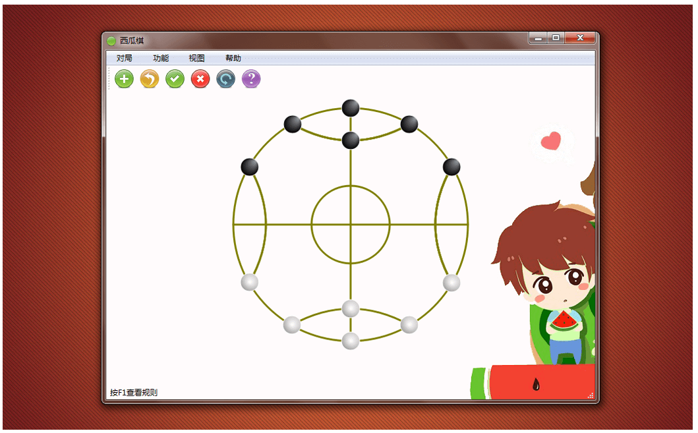
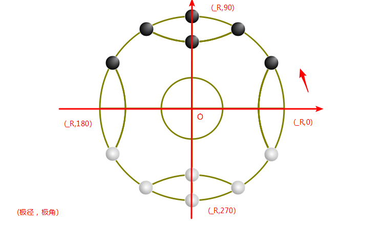
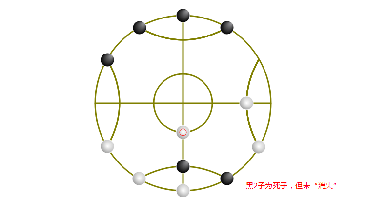

打算写这个游戏的想法不是“蓄谋已久”的，它不过是为了完成作业而作出来的产物。虽然到目前为止，它还有许多的不足，但至少没有“胎死腹中”。<!--（有兴趣的朋友可以下来玩玩：[点我下载](https://github.com/tatwd/watermelon-chess/raw/master/wiki-resources/downloads/watermelon-chess-1.6.1-install.exe)）-->



这种棋，是我小时候经常玩的，玩法大多是就地取材：在地上画个棋盘，以石头或树叶或树枝什么的为棋子，各6个。规则很简单：石头剪刀布决定谁现在走，每人轮流走一步，将对方棋子围死即可拿走，一方棋子数小于3个即输。像这类的棋，我小时候还玩过许多。

刚开始，我设想这游戏有两种模式：单机模式、联机模式。如果要实现话，得完成以下几步：`1)棋盘及棋子的绘制；2)实现人走棋；3)实现吃棋；4)实现悔棋、认输、和棋等 功能；5)实现电脑走棋。`本来还想实现联机模式的，后来发现还是留到以后再说吧。

## 界面绘制

<!-- more -->

我首先遇到的第一个问题是怎样方便快捷地实现图形界面的绘制，即棋盘棋子的绘制。在此之前，我没有一点的窗体编程的经验，也不清楚用那种语言来开发更合理，没办法我只能找度娘、看大神的经验之谈了。最终，我选择了`C++`和`Qt`。在选工具时，本来想选Visual Studio 2013的，后来发现它的内库不太方便（好吧，其实是我看不太懂），所以就放弃了，选了Qt。

Qt的绘图相对较简单。创建一个Qt Widgets Application应用，在实现类（如：Board类）中的绘图事件paintEvent中，用QPainter创建一个画笔对象，然后用这个对象去调用它的成员函数来绘制图形即可。如：

``` cpp
#include "Board.h"
#include <QPainter>

void Board::paintEvent(QPaintEvent *)
{
  QPainter painter(this);                             //创建画笔对象
  painter.drawEllipse(QPoint(200,300), 50, 50);       //画圆，传入圆心坐标、长轴、短轴
  painter.drawLine(QPoint(100,300), QPoint(200,100)); //画线，传入直线的起点、终点坐标
}
```

## 选坐标系

然而，在绘制棋子时，我又遇到了一个严重的问题：坐标系的选择。刚开始，我用的是直角坐标系，发现能够把所有棋子都绘制出来，但棋子的遍历（包括棋盘上所点的遍历）却成了一个极大的问题。如果不解决话，后面的走棋、吃棋等都无法实现或者说很难实现。这个问题一度让我写不下去了（停了一个多礼拜）。后来突然有一天，脑子一抽，发现我的棋盘是一个关于中心对称的圆形啊，为什么不能用极坐标系呢？以棋盘中心为原点，只需要一个`极径`和一个`极角`就能确定棋盘上所有的点。



于是乎，遍历问题便不难了:

``` cpp
... ...
/*获取棋盘上点的极坐标*/
void Board::getAROfBoard(int pos, int &angle, int &r)
{
  angle = 0;
  r = 0;
  if(pos>=0 && pos<=11)       //第0~11个点，即第1圈
  {
    angle = pos*30;
    r = _R;
  }
  else if(pos>=12 && pos<=19) //第12~19个点，即第2、3圈
  {
    angle = (pos%4) * 90;
    r = _R*13/18;
    if(pos>15)
      r = _R/3;
  }
  //中心点（即第4圈）为(0, 0)
}

/*遍历棋盘所有的点并返回该点pos的像素坐标*/
QPoint Board::getPointOfBoard(int pos, int &angle, int &r)
{
  QPoint bCenter(0, 0); //棋盘中心坐标
  getAROfBoard(pos, angle, r); //获取该点的极坐标
  return polarCoordToXY(bCenter, angle, r);  //将极坐标转成像素坐标
}
... ...
```

## 死子判断

在解决了这个问题之后，我又迎来了第3个大问题：死子判断。虽然利用下面的算法完成了对单个棋子的死活判断，但没有实现对多个棋子的判断（目前还未去解决，待解决）。

``` cpp
... ...
/*获取棋子被围数*/
int Board::getSurroundStone(int id)
{
  QPoint sCenter = polarCoordToXY(QPoint(0,0), id); //获取该子的像素坐标
  int d = _R*10/18;
  int n = 0;
  for(int i = 0;i < 12;++i)
  {
    if(_s[i]._dead)
      continue;

    QPoint iCenter = polarCoordToXY(QPoint(0,0), i);
    int dx = sCenter.x() - iCenter.x();
    int dy = sCenter.y() - iCenter.y();

    //被对手棋子全包围时
    if((dx*dx + dy*dy)>0 && (dx*dx + dy*dy) <= d*d && _s[i]._black != _s[id]._black)
      n++;
  }
  return n;
}
... ...
```

也就是说，当单个棋子被对手棋子全包围时，它会判断为死子，然后“消失”；但是，2个或2个以上的情况不会。



## 电脑走棋

电脑走棋方面，我使用的较为简单，大概相当于三岁小孩的水平，更深层次的还没有研究过。本来打算使用最近比较火的机器学习（Machine Learning, ML），我研究一段时间后，还是老老实实地用简单的吧。具体实现：先获取所有可能走法存入一个数组，然后对其中的每一步进行假想走棋并评估该走法的价值，最终得到一个最佳走法，从而使电脑来走。其中，价值评估算法（最小最大值算法）较为简陋，简单讲，就是被对手围的越少的走法，价值越高。

``` cpp
/*电脑走棋*/
void SingleGame::computerMove()
{
  Step* step = getBestStep(); //获取最佳走法
  moveStone(step->_movedId, step->_killId, step->_angleTo, step->_rTo); //走棋
  Board::movePromptInStatusBar(); //落子提示
  delete step;
  update();
}

/*获取最佳走法*/
Step* SingleGame::getBestStep()
{
  QVector<Step *> steps;
  getAllPossibleMove(steps);

  int maxScore = -100000;
  Step* ret = NULL;
  while(steps.count())
  {
    Step* step = steps.last();
    steps.removeLast();

    fakeMove(step); //假想走棋
    int score = getMinScore(_level - 1, maxScore); //最小分
    unfakeMove(step); //恢复

    if(score > maxScore)
    {
      maxScore = score;
      if(ret)
        delete ret;
      ret = step;
    }
    else
    {
      delete step; //防止内存泄漏
    }
  }
  return ret;
}
```

总而言之，从预期来说，大部分功能已经实现，目前还未解决的问题还有两个：1)死子判断算法的完善；2)价值评估算法的优化。以后有可能的话，希望能实现联机模式，但到底可不可能，谁知道呢？

项目地址： https://github.com/tatwd/watermelon-chess
