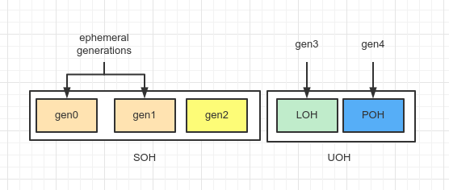

关于 GC 分代与 SOH 及 LOH 的关系问题，常常看到有的文章是表述存在问题的。这里我尝试将其指出。

## 一共有多少代

这里可以直接看运行时中 [`gc.h`](https://github.com/dotnet/runtime/blob/265988529080aa6e88f1d2ea12d9c080c93465e4/src/coreclr/gc/gc.h#L106) 中的枚举 `gc_generation_num` 是怎么设计的：

```cpp
enum gc_generation_num
{
    // small object heap includes generations [0-2], which are "generations" in the general sense.
    soh_gen0 = 0,
    soh_gen1 = 1,
    soh_gen2 = 2,
    max_generation = soh_gen2,

    // large object heap, technically not a generation, but it is convenient to represent it as such
    loh_generation = 3,

    // pinned heap, a separate generation for the same reasons as loh
    poh_generation = 4,

    uoh_start_generation = loh_generation,

    // number of ephemeral generations
    ephemeral_generation_count = max_generation,

    // number of all generations
    total_generation_count = poh_generation + 1
};
```

所谓分期待，其实就是分配索引，用来访问 `generation_table` / `dynamic_data_table`，从这个意义上讲，最大代数就是 `total_generation_count` 的值 5。

注意，当我们调用 `GC.MaxGeneration` 时，其结果一情况下，返回的就是这个枚举的 `max_generation` 值，亦即 SOH 的最大代值是 2（zero-based）。


## SOH、LOH 的分代

从上面的枚举及注释，我们可以看到，SOH 分 3 代（gen0，gen1，gen2）。

那 LOH 是只分一代（gen3）么？

答案从注释我们可以知道，LOH 的“分代”只是为了迁就 SOH 的分代设计，让其表现上（logical）只有一个分代，实际上对 LOH 并不做分代处理。这一点在在 [`botr/garbage-collection.md`](https://github.com/dotnet/runtime/blob/main/docs/design/coreclr/botr/garbage-collection.md#logical-representation-of-the-managed-heap) 也明确指出了：

>  There is only one generation for large objects and they are always collected with gen2 collections due to performance reasons. Both gen2 and gen3 can be big, and collecting ephemeral generations (gen0 and gen1) needs to have a bounded cost.

也即是说，LOH 在托管内存上是单独的一个地址段，与 SOH 是分开的，LO 并不存在 gen2 上，只不过对 LO 的回收与 gen2 是一起发生的。

## POH 的分代

POH 是 .NET 5 新增加的，分代是 gen4，它拥有属于自己地址段，与 LOH 是类似的，故而，运行时团队将 POH 和 LOH 统称叫 UOH（User Old Heap）。

## 总结

可以用下图表示：



GC 在回收垃圾时，分代管理（代间转移）只发生在 SOH 上，只有在对 gen2 进行回收时才会同时对 LOH 进行垃圾回收。


## 参考资料

1. [.NET CLR GC Implementation](https://github.com/dotnet/runtime/blob/265988529080aa6e88f1d2ea12d9c080c93465e4/src/coreclr/gc/gc.h)
2. [Garbage Collection Design](https://github.com/dotnet/runtime/blob/main/docs/design/coreclr/botr/garbage-collection.md)
3. [Internals of the POH](https://devblogs.microsoft.com/dotnet/internals-of-the-poh/)
